# Azure Virtual Desktop

<details><summary>Table of Contents</summmary>

- [Azure Virtual Desktop](#azure-virtual-desktop)
  - [Scope](#scope)
    - [Solution](#solution)
    - [Solution Outcomes](#solution-outcomes)
      - [Option 1](#option-1)
      - [Option 2](#option-2)
    - [Decision areas](#decision-areas)
      - [Azure DevOps Automation](#azure-devops-automation)
      - [Azure Subscription and Domain Controller connectivity](#azure-subscription-and-domain-controller-connectivity)
      - [Azure Regions](#azure-regions)
      - [Custom Images](#custom-images)
      - [Custom Image as Code](#custom-image-as-code)
      - [Stateless or stateful VMs](#stateless-or-stateful-vms)
      - [auto-scaling](#auto-scaling)
      - [Session Hosts](#session-hosts)
      - [User Proflies](#user-proflies)
      - [User Proflie backup](#user-proflie-backup)
      - [Monitoring](#monitoring)
  - [Features](#features)
    - [Backups](#backups)
    - [Drain Mode](#drain-mode)
    - [FSLogix](#fslogix)
    - [GPU Drivers \& Settings](#gpu-drivers--settings)
    - [High Availability](#high-availability)
    - [Monitoring](#monitoring-1)
    - [AutoScale Scaling Plan](#autoscale-scaling-plan)
    - [Customer Managed Keys for Encryption](#customer-managed-keys-for-encryption)
    - [SMB Multichannel](#smb-multichannel)
    - [Start VM On Connect](#start-vm-on-connect)
    - [Trusted Launch](#trusted-launch)
    - [Confidential VMs](#confidential-vms)
    - [IL5 Isolation](#il5-isolation)
      - [IL5 Prerequisites](#il5-prerequisites)
      - [Resources Deployed](#resources-deployed)
  - [Design](#design)
    - [Overview](#overview)
  - [Prerequisites](#prerequisites)
    - [Required](#required)
    - [Optional](#optional)
  - [Quickstart Guide](#quickstart-guide)
    - [Overview](#overview-1)
    - [Setup](#setup)
      - [Permissions](#permissions)
      - [Tools](#tools)
        - [PowerShell Az Module Installation](#powershell-az-module-installation)
        - [Bicep Installation](#bicep-installation)
      - [Authentication to Azure](#authentication-to-azure)
      - [Resource Provider Registration](#resource-provider-registration)
      - [Template Spec Creation](#template-spec-creation)
      - [Networking](#networking)
      - [Confidential VM Disk Encryption with Customer Managed Keys (Optional)](#confidential-vm-disk-encryption-with-customer-managed-keys-optional)
    - [Deployment](#deployment)
      - [Deploy Image Management Resources](#deploy-image-management-resources)
      - [Create a Custom Image (optional)](#create-a-custom-image-optional)
      - [Deploy an AVD Host Pool](#deploy-an-avd-host-pool)
    - [Validation](#validation)
  - [Zero Trust Framework](#zero-trust-framework)
    - [Executive Summary](#executive-summary)
    - [Zero Trust and Azure Virtual Desktop (AVD) Project: An Overview](#zero-trust-and-azure-virtual-desktop-avd-project-an-overview)
    - [Zero Trust Pinciples](#zero-trust-pinciples)
      - [Verify](#verify)
      - [Use Least Privilege Access](#use-least-privilege-access)
      - [Assume Breach](#assume-breach)
    - [AVD Design and Zero Trust](#avd-design-and-zero-trust)
      - [Business Unit Identifier](#business-unit-identifier)
      - [Host Pool Identifer](#host-pool-identifer)
      - [Centralized AVD Monitoring](#centralized-avd-monitoring)
    - [Zero Trust Implementation in AVD Offering](#zero-trust-implementation-in-avd-offering)
      - [Verification of Identities and Endpoints](#verification-of-identities-and-endpoints)
      - [Least Privilege Access](#least-privilege-access)
      - [Breach Assumption and Segmentation](#breach-assumption-and-segmentation)
      - [Use of Azure Services to Enforce Zero Trust](#use-of-azure-services-to-enforce-zero-trust)
      - [Deivations and Considerations](#deivations-and-considerations)
      - [Deviations from Standard Zero Trust Practices](#deviations-from-standard-zero-trust-practices)
      - [Project-Specific Considerations](#project-specific-considerations)
    - [Conclusion](#conclusion)
    - [References](#references)
  - [Troubleshooting](#troubleshooting)
    - [WinError 193](#winerror-193)
  - [AVD Host Pool Deployment Parameters](#avd-host-pool-deployment-parameters)
    - [Required Parameters](#required-parameters)
  - [Conditional Parameters](#conditional-parameters)
  - [Optional Parameters](#optional-parameters)
  - [UI Generated / Automatic Parameters](#ui-generated--automatic-parameters)
  - [Examples](#examples)
    - [Required Parameters Only](#required-parameters-only)
    - [Zero Trust Compliant](#zero-trust-compliant)
    - [Shard FSLogix Storage with Permissions](#shard-fslogix-storage-with-permissions)
    - [Enable Scaling Plan](#enable-scaling-plan)
    - [IL5 Isolation Requirements on IL4](#il5-isolation-requirements-on-il4)
  - [AVD Image Build Parameters](#avd-image-build-parameters)
    - [Required Parameters](#required-parameters-1)
    - [Conditional Parameters](#conditional-parameters-1)
    - [Optional Parameters](#optional-parameters-1)
  - [Examples](#examples-1)
    - [Required Parameters Only](#required-parameters-only-1)
    - [Additional Customizations](#additional-customizations)
    - [Install Updates via Windows Update](#install-updates-via-windows-update)
    - [New Image Definition and multiple region distribution](#new-image-definition-and-multiple-region-distribution)
  - [AVD Image Management Parameters](#avd-image-management-parameters)
    - [Optional Parameters](#optional-parameters-2)
  - [Examples](#examples-2)
    - [Private Endpoints](#private-endpoints)
    - [Service Endpoints](#service-endpoints)
    - [Tags](#tags)

</details>

## Scope

### Solution

The Azure Virtual Desktop (AVD) solution offering will deploy fully operational AVD Hostpool(s) to an Azure Subscription.  

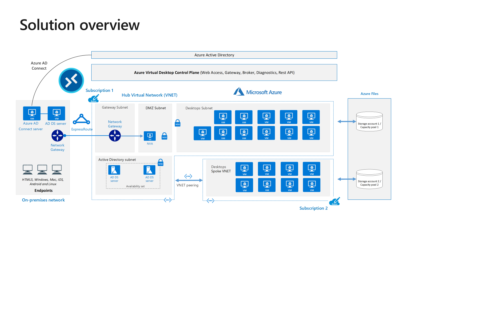

This solution incorporates the 3 areas of client, Azure Virtual Desktop control plane, and Azure VMs as shown below:

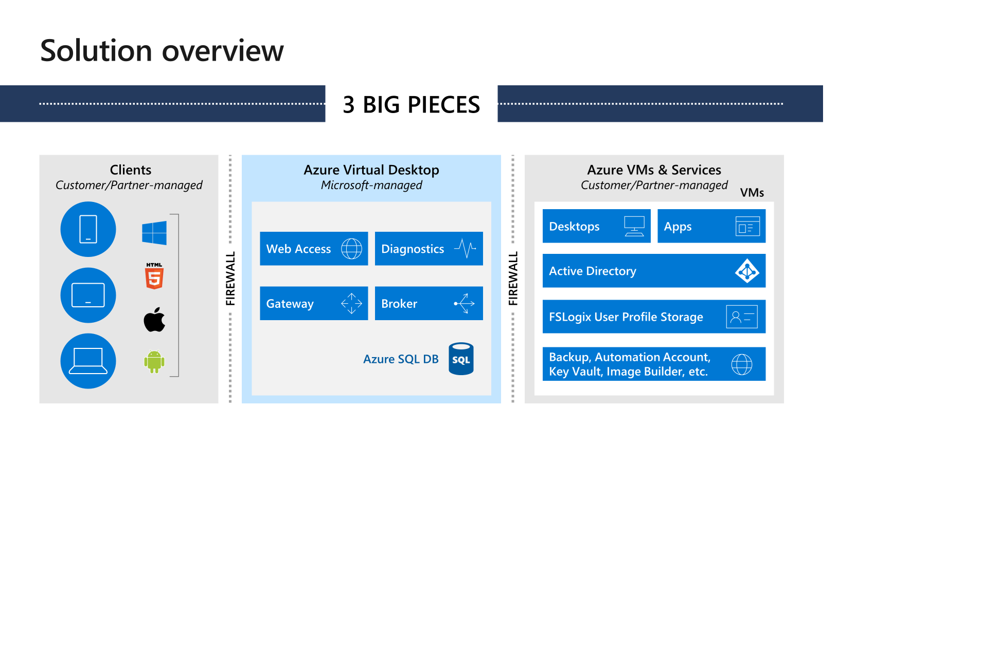

The offering takes into account the elimination of most management infrastructure, session hosts provisioned into your subscriptions as needed, using native Windows 11 interface and enablement of Office 365.  

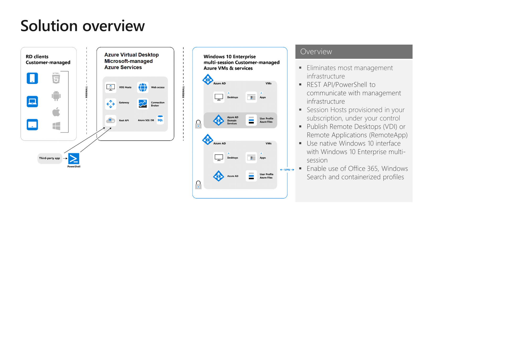

### Solution Outcomes

#### Option 1

Description: Implement with DevOps with lifecycle management based on custom images.

Outcomes:

1. Deployment of an Azure Virtual Desktop (AVD) solution with Azure DevOps automation that includes:
   - Provision of up to 2 AVD host pools with up to 4 session host VMs each based on custom images.
   - Create up to 6 AVD app groups and assistance.
   - Publish up to 6 RemoteApp applications or remote desktops.
1. Generate 1 custom image from code, using:
   - Azure DevOps pipelines and PowerShell scripts.
   - Azure Image Builder, Azure Shared Image Gallery.
   - Host pool lifecycle management based on custom images.
1. Enablement of FSLogix Office and Proflie containers which includes:
   - Configuration of Azure Files to store profile containers.
   - Option to backup file shares to Recovery Services Vault (SRV).
1. Host Pool Scaling Plans.
1. Configuration of Diagnostics logs from Azure Virtual Desktlop to Azure Log Analytics.

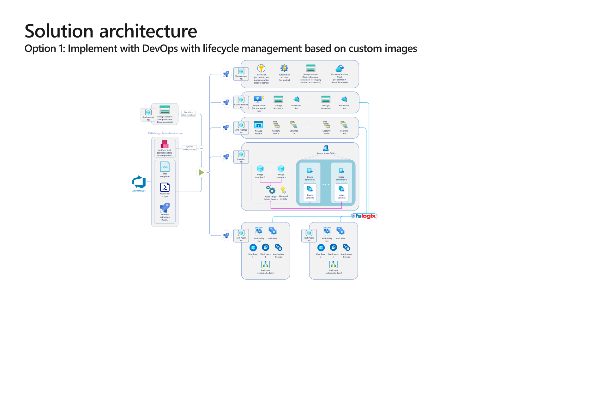

#### Option 2

Description: Implement with DevOps based on Marketplace images.

Outcomes:

1. Deployment of an Azure Virtual Desktop (AVD) solution with Azure DevOps automation that includes:
   1. Provision up to 2 AVD host pools with up to 4 session host VMs each, based on Azure marketplace images.
2. Create up to 6 AVD app groups and assistance.
   1. Publish up to 6 RemoteApp applications or remote desktops.
3. Enablement of FSLogix Office and Profile Containers which includes:
   - Configuration of Azure Files to store the profile containers.
   - Option to backup file shares to Recovery Services Vault (RSV).
4. Host Pool Scaling Plans.
5. Configuration of Diagnostics logs from Azure Virtual Desktlop to Azure Log Analytics.

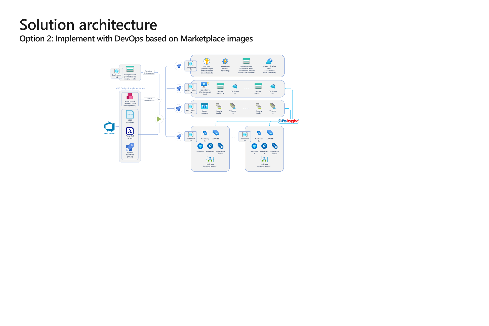

### Decision areas

#### Azure DevOps Automation

- [ ] Do you already use Azure DevOps? Are you comfortable with using and modifying BICEP files, PowerShell scripts, and YAML pipelines?

If you already use Azure DevOps, we recommend the Azure Virtual Desktop Design and Implementation component to facilitate rapid deployment and/or code-based lifecycle management.
Using the automation solution has significant benefits over manual deployment: it makes the process reliably repeatable and scalable.

The true potential of this solution can only be unlocked if your teams are familiar with the tools used in the solution, such as: BICEP files, PowerShell scripts, and YAML pipelines – thus, the DevOps Automation solution can be leveraged beyond the initial deployment of the AVD environment in scope.

If the answer to the above question is yes, this AVD Design and Implementation solution is strongly recommended.

If the answer is no, ISD can only assist you with building an automated solution based on BICEP templates and PowerShell scripts, leveraging your choice of pipeline solution.

#### Azure Subscription and Domain Controller connectivity

- [ ] Do you have an existing Azure subscription with connectivity to Domain Controllers?

Implementing Azure Virtual Desktop requires an Azure subscription and access to Active Directory Domain Services. An existing domain is typically used but we can also use Entra ID Domain Services. Note, that Entra ID Domain Services has certain limitations, e.g. using custom GPO ADMX templates is not supported; you have to sync password hashes to Entra ID to leverage Entra ID Domain Services for AVD.

Session Hosts MUST be domain joined and cannot be simply managed using Intune or competing products. Domain Services may be available in various ways:

- Azure VNETs have access to domain controllers hosted in Azure (same or other VNET).
- Azure VNETs have access to domain controllers on-premises through ExpressRoute or S2S VPN.
- Customer implemented Entra ID Domain Services.

Entra ID Domain Services
This approach has limitations but doesn’t require you to manage Domain Controllers in the cloud.

Active Directory Domain Services
This approach provides you all capabilities of Active Directory, but you need to set up and manage Domain Controllers in Azure.

#### Azure Regions

- [ ] Do you wish to deploy AVD in a single Azure region?

When deploying to a single Azure region, we can simply leverage a set of cloud file shares (Azure Files) and have the best experience when using Azure AD Domain Services (Azure ADDS) or on-premises Active Directory Domain Services (ADDS).

In case of a multi-region deployment, users’ profiles must be as close to the AVD VMs they log in to, as possible. This requires a more complex design, including networking requirements, Azure Files service deployed in multiple regions, or leveraging a multi-region or replication capable file service (not covered in this solution).

#### Custom Images

- [ ] In the cloud, would you leverage custom images to package applications and/or optimized OS/App configuration to facilitate rapid deployment?

The default Azure Virtual Desktop deployment uses Azure Marketplace images (any supported Windows Server or Windows client OS). However, we can customize the deployment to use your own images and help manage your images using Azure Image Builder (or the Zero Trust Compliant image build solution provided in this repo) and Shared Image Galleries.

Using custom images to deliver Azure Virtual Desktop can speed up the resource deployment process, as (majority of) the application components are not installed on the VMs at deployment time.

If you plan to leverage cloud native technologies, such as Azure DevOps pipelines, PowerShell scripts, Azure Image builder, and Azure Shared Image Gallery to programmatically generate images , we recommend you “Option 1: Implement with DevOps with lifecycle management based on custom images” within this AVD Design and Implementation solution.

If you don’t prefer to leverage custom images, and you accept the added time that it takes to programmatically install application on your AVD VMs at deployment time, you would like to manually install applications on your AVD VMs, we recommend “Option 2: Implement with DevOps based on Marketplace images” within this AVD Design and Implementation solution.

NOTE: Microsoft can only assist with customizing images based on Azure native technologies. Image customization activities will be time-boxed.

#### Custom Image as Code

- [ ] Would you like to leverage Azure DevOps and the custom image creation deployment capability to programmatically generate custom images, or do you already have an existing imaging solution for your desktops that you plan to use for AVD?

If you would like to programmatically generate images using cloud native technologies, such as Azure DevOps pipelines, PowerShell scripts, and Azure Shared Image Gallery, we recommend you “Option 1: Implement with DevOps with lifecycle management based on custom images” of this AVD Design and Implementation solution.

Using your existing imaging solution is not covered by this solution, therefore it requires either leveraging the “Azure Virtual Desktop Imaging” solution, or custom work.

Regardless of the chosen custom image management solution, the produced image must be Azure- compatible – i.e. the required agent and other optimization components must be in place.

#### Stateless or stateful VMs

- [ ] Would you like to implement the concept of immutable VMs in your AVD environment?

If you would like to leverage the true potential of Azure and DevOps automation, we recommend leveraging an automated lifecycle-management approach within the “Option 1: Implement with DevOps with lifecycle management based on custom images” solution option.

This approach allows you to treat your Virtual Machines as “cattle”, making them immutable. This means that instead of patching/managing the VMs of your Host Pool, you can programmatically redeploy them, based on the latest available image, application, and configuration version.

#### auto-scaling

- [ ] Do you need auto-scaling?

Our auto-scaling solution includes schedule-based scale out and scale in to help reduce costs.

This auto-scaling solution is already embedded to the Design and Implementation component. In case this is not needed, it can be easily disabled.

NOTE: At this time, auto-scaling is still not available in USNat and USSec. Subject to change.

#### Session Hosts

- [ ] How many Session Hosts, Desktops, and/or Apps will be published?

By default, the solution provides up to 2 Host Pools with up to 4 Session Hosts.

If you have more Desktop or Apps that need to be published, the design/planning will allow for the increase of the number of Session Hosts to accommodate  requirements (up to AVD limits).

#### User Proflies

- [ ] How many user profiles are anticipated?  Do you plan to use FSLogix Profile and/or Office containers?
- [ ] Will Office 365 be deployed?

Understanding the number of users (and therefore user profiles) helps define the scale of the profile infrastructure.

The AVD service recommends FSLogix profile containers as a user profile solution – it is designed to roam profiles in remote computing environments, such as AVD.

Office Container redirects only areas of the profile that are specific to Microsoft Office and is a subset of Profile container. Office Container are generally implemented with another profile solution. There is no need to implement Office Container if Profile Container is your primary solution for managing profiles.

Office Container could optionally be used in conjunction with Profile Container, to place Office Data in a location separate from the rest of the user's profile.

#### User Proflie backup

- [ ] Would you like to secure your user profile data assets by backing up the centrally stored user profiles to Azure Recovery Services Vault (RSV)?

Backing up valuable User profile data to Azure Recovery Services Vault (RSV) is recommended in most cases, since the data can be backed up in the same Azure where it is kept.

#### Monitoring

- [ ] Do you require enhanced logging of Azure Virtual Desktop diagnostics data?

If yes, “Azure Virtual Desktop Enhanced Monitoring” additional tailored consulting is required.

Azure Virtual Desktop (control plane) is integrated with Azure Monitor. Diagnostics from the Session Hosts (data plane), additional dashboards, and other customizations require additional consulting.

## Features

- [**Backups**](#backups)
- [**Drain Mode**](#drain-mode)
- [**FSLogix**](#fslogix)
- [**GPU Drivers & Settings**](#gpu-drivers--settings)
- [**High Availability**](#high-availability)
- [**Monitoring**](#monitoring)
- [**AutoScale Scaling Plan**](#autoscale-scaling-plan)
- [**Customer Managed Keys for Encryption**](#customer-managed-keys-for-encryption)
- [**SMB Multichannel**](#smb-multichannel)
- [**Start VM On Connect**](#start-vm-on-connect)
- [**Trusted Launch**](#trusted-launch)
- [**Confidential VMs**](#confidential-vms)
- [**IL5 Isolation**](#il5-isolation)

### Backups

This optional feature enables backups to protect user profile data. When selected, if the host pool is "pooled" and the storage solution is Azure Files, the solution will protect the file share. If the host pool is "personal", the solution will protect the virtual machines.

**Reference:** [Azure Backup - Microsoft Docs](https://docs.microsoft.com/en-us/azure/backup/backup-overview)

**Deployed Resources:**

- Recovery Services Vault
- Backup Policy
- Protection Container (File Share Only)
- Protected Item

### Drain Mode

When this optional feature is deployed, the sessions hosts will be put in drain mode to ensure the end users cannot access them until they have been validated.

**Reference:** [Drain Mode - Microsoft Docs](https://docs.microsoft.com/en-us/azure/virtual-desktop/drain-mode)

**Deployed Resources:**

- Virtual Machine
  - Run Command
  
### FSLogix

If selected, this solution will deploy the required resources and configurations so that FSLogix is fully configured and ready for immediate use post deployment.

Azure Files and Azure NetApp Files are the only two SMB storage services available in this solution.  A management VM is deployed to facilitate the domain join of Azure Files (AD DS only) and configures the NTFS permissions on the share(s). With this solution, FSLogix containers can be configured in multiple ways:

- Cloud Cache Profile Container
- Cloud Cache Profile & Office Container
- Profile Container (Recommended)
- Profile & Office Container

**Reference:** [FSLogix - Microsoft Docs](https://docs.microsoft.com/en-us/fslogix/overview)

In addition to the optional deployment of resources, you can choose to configure the registry of session host VMs with the proper registry settings to support each of these container types whether or not the resources are deployed. In addition, if you choose one of the Cloud Cache options, you can provide storage accounts in remote regions to support an active/active Business Continuity and disaster recovery configuration as documented at https://learn.microsoft.com/en-us/fslogix/concepts-container-recovery-business-continuity#option-3-cloud-cache-active--active.

**Deployed Resources:**

- Azure Storage Account (Optional)
  - File Services
  - Share(s)
- Azure NetApp Account (Optional)
  - Capacity Pool
  - Volume(s)
- Virtual Machine
- Network Interface
- Disk
- Private Endpoint (Optional)
- Private DNS Zone (Optional)

### GPU Drivers & Settings

When an appropriate VM size (Nv, Nvv3, Nvv4, or NCasT4_v3 series) is selected, this solution will automatically deploy the appropriate virtual machine extension to install the graphics driver and configure the recommended registry settings.

**Reference:** [Configure GPU Acceleration - Microsoft Docs](https://docs.microsoft.com/en-us/azure/virtual-desktop/configure-vm-gpu)

**Deployed Resources:**

- Virtual Machines Extensions
  - AmdGpuDriverWindows
  - NvidiaGpuDriverWindows
  - CustomScriptExtension

### High Availability

This optional feature will deploy the selected availability option and only provides high availability for "pooled" host pools since it is a load balanced solution.  Virtual machines can be deployed in either Availability Zones or Availability Sets, to provide a higher SLA for your solution.  SLA: 99.99% for Availability Zones, 99.95% for Availability Sets.  

**Reference:** [Availability options for Azure Virtual Machines - Microsoft Docs](https://docs.microsoft.com/en-us/azure/virtual-machines/availability)

**Deployed Resources:**

- Availability Set(s) (Optional)

### Monitoring

This feature deploys the required resources to enable the AVD Insights workbook in the Azure Virtual Desktop blade in the Azure Portal.

**Reference:** [Azure Monitor for AVD - Microsoft Docs](https://docs.microsoft.com/en-us/azure/virtual-desktop/azure-monitor)

In addition to Insights Monitoring, the solution also allows you to send security relevant logs to another log analytics workspace. This can be accomplished by configuring the `securityLogAnalyticsWorkspaceResourceId` parameter for the legacy Log Analytics Agent or the `securityDataCollectionRulesResourceId` parameter for the Azure Monitor Agent.

**Deployed Resources:**

- Log Analytics Workspace
- Data Collection Endpoint
- Data Collection Rules
  - AVD Insights
  - VM Insights
- Azure Monitor Agent extension
- System Assigned Identity on all deployed Virtual Machines
- Diagnostic Settings
  - Host Pool
  - Workspace

### AutoScale Scaling Plan

Autoscale lets you scale your session host virtual machines (VMs) in a host pool up or down according to schedule to optimize deployment costs.

**Reference:** [AutoScale Scaling Plan - Microsoft Docs](https://learn.microsoft.com/en-us/azure/virtual-desktop/autoscale-create-assign-scaling-plan)

### Customer Managed Keys for Encryption

This optional feature deploys the required resources & configuration to enable virtual machine managed disk encryption on the session hosts using a customer managed key. The configuration also enables double encryption which uses a platform managed key in combination with the customer managed key. The FSLogix storage account can also be encrypted using Customer Managed Keys.

**Reference:** [Azure Server-Side Encryption - Microsoft Docs](https://learn.microsoft.com/azure/virtual-machines/disk-encryption)

**Deployed Resources:**

- Key Vault (1 per host pool for VM disks, 1 for each fslogix storage account)
  - Key Encryption Key
- Disk Encryption Set

### SMB Multichannel

This feature is automatically enabled when Azure Files Premium is selected for FSLogix storage. This feature is only supported with Azure Files Premium and it allows multiple connections to an SMB share from an SMB client.

**Reference:** [SMB Multichannel Performance - Microsoft Docs](https://docs.microsoft.com/en-us/azure/storage/files/storage-files-smb-multichannel-performance)

### Start VM On Connect

This optional feature allows your end users to turn on a session host when all the session hosts have been stopped / deallocated. This is done automatically when the end user opens the AVD client and attempts to access a resource.  Start VM On Connect compliments scaling solutions by ensuring the session hosts can be turned off to reduce cost but made available when needed.

**Reference:** [Start VM On Connect - Microsoft Docs](https://docs.microsoft.com/en-us/azure/virtual-desktop/start-virtual-machine-connect?tabs=azure-portal)

**Deployed Resources:**

- Role Assignment
- Host Pool

### Trusted Launch

This feature is enabled automatically with the safe boot and vTPM settings when the following conditions are met:

- a generation 2, "g2", image SKU is selected
- the VM size supports the feature

It is a security best practice to enable this feature to protect your virtual machines from:

- boot kits
- rootkits
- kernel-level malware

**Reference:** [Trusted Launch - Microsoft Docs](https://docs.microsoft.com/en-us/azure/virtual-machines/trusted-launch)

**Deployed Resources:**

- Virtual Machines
  - Guest Attestation extension

### Confidential VMs

Azure confidential VMs offer strong security and confidentiality for tenants. They create a hardware-enforced boundary between your application and the virtualization stack. You can use them for cloud migrations without modifying your code, and the platform ensures your VM’s state remains protected.

**Reference:** [Confidential Virtual Machines - Microsoft Docs](https://learn.microsoft.com/en-us/azure/confidential-computing/confidential-vm-overview)

**Deployed Resources:**

- Azure Key Vault Premium
  - Key Encryption Key protected by HSM
- Disk Encryption Set

### IL5 Isolation

Azure Government supports applications that use Impact Level 5 (IL5) data in all available regions. IL5 requirements are defined in the [US Department of Defense (DoD) Cloud Computing Security Requirements Guide (SRG)](https://public.cyber.mil/dccs/dccs-documents/). IL5 workloads have a higher degree of impact to the DoD and must be secured to a higher standard. When you deploy this solution to the IL4 Azure Government regions (Arizona, Texas, Virginia), you can meet the IL5 isolation requirements by configuring the parameters to deploy the Virtual Machines to dedicated hosts and using Customer Managed Keys that are maintained in Azure Key Vault and stored in FIPS 140 Level 3 validated Hardware Security Modules (HSMs).

**Reference:** [Azure Government isolation guidelines for Impact Level 5 - Azure Government | Microsoft Learn](https://learn.microsoft.com/en-us/azure/azure-government/documentation-government-impact-level-5)

#### IL5 Prerequisites

You must have already deployed at least one dedicated host into a dedicated host group in one of the Azure US Government regions. For more information about dedicated hosts, see (https://learn.microsoft.com/en-us/azure/virtual-machines/dedicated-hosts).

#### Resources Deployed

- Azure Key Vault Premium (Virtual Machine Managed Disks - 1 per host pool)
  - Customer Managed Key protected by HSM (Auto Rotate enabled)
- Disk Encryption Set
- Azure Key Vault Premium (FSLogix Storage Accounts - 1 per storage account)
  - Customer Managed Key protected by HSM (Auto Rotate enabled)

For an example of the required parameter values, see: [IL5 Isolation Requirements on IL4](#il5-isolation-requirements-on-il4)

## Design

### Overview

This Azure Virtual Desktop (AVD) solution will deploy fully operational AVD hostpool(s) to an Azure subscription.

The deployment utilizes the Cloud Adoption Framework naming conventions and organizes resources and resource groups in accordance with several available parameters:

- Persona Identifier (***identifier***): This parameter is used to uniquely identify the persona of the host pool(s). Each persona, or each group of users with distinct business functions and technical requirements, would require a specific host-pool configuration and thus we use the persona term to identify the host pool. For more information about personas see [User Personas | AVD Cloud Adoption Framework](https://learn.microsoft.com/en-us/azure/cloud-adoption-framework/scenarios/azure-virtual-desktop/migrate-assess#user-personas).

- Host Pool Index (***index***): This *optional* parameter is used when we must shard the unique persona across multiple host pools. For more information, see [Sharding Pattern](https://docs.microsoft.com/en-us/azure/architecture/patterns/sharding).

- Name Convention Reversed (***nameConvResTypeAtEnd***): This bolean parameter, which is by default 'false', will move the resource type abbreviation to the end of the resource names effectively reversing the CAF naming standard.

The diagram below highlights how the resource groups are created based on the parameters.

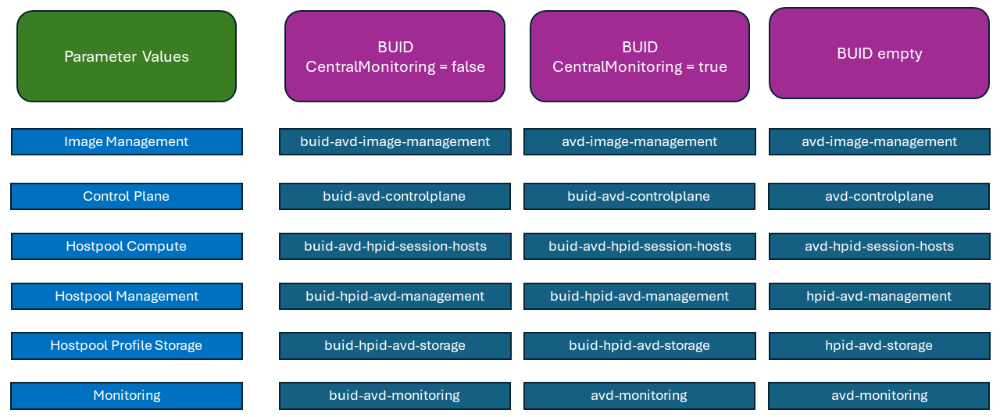

The diagram illustrates the following resource group distribution. In the table below, the example names are utilizing the following parameter values:

- **identifier**: 'hr'
- **index**: '01', '02'
- locationVirtualMachines (determined by **virtualMachineSubnetResourceId** location): 'USGovVirginia'
- **locationControlPlane**: 'USGovVirginia'
- **nameConvResTypeAtEnd**: false

| Purpose | Resources | Example Name | Notes |
| ------- | :-------: | ------------ | ----- |
| Global Feed | global feed workspace | rg-avd-global-feed | One per Tenant |
| Management | monitoring resources<br>key vault<br>app service plan  | rg-avd-management-va | One per region |
| Control Plane | feed workspace<br>application groups<br>hostpools<br>scaling plans | rg-avd-control-plane-va | One per region |
| Hosts | virtual machines<br>recovery service vault<br>disk encryption set<br>key vault | rg-hr-01-hosts-va<br>rg-hr-02-hosts-va | One per identifier or per index (if specified) |
| Storage | NetApp Storage Accounts<br>Storage Account(s)<br>function app<br>key vault(s) | rg-hr-01-storage-va<br>rg-hr-02-storage-va | One per identifier or per index (if specified) |

The code is idempotent, allowing you to scale storage and sessions hosts, but the core management resources will persist and update for any subsequent deployments. Some of those resources are the host pool, application group, and log analytics workspace.

Both a personal or pooled host pool can be deployed with this solution. Either option will deploy a desktop application group with a role assignment. You can also deploy the required resources and configurations to fully enable FSLogix. This solution also automates many of the [features](#features) that are usually enabled manually after deploying an AVD host pool.

With this solution you can scale up to Azure's subscription limitations. This solution has been updated to allow sharding. A shard provides additional capacity to an AVD hostpool. See the details below for increasing storage capacity.

## Prerequisites

To successfully deploy this solution, you will need to ensure the following prerequisites have been completed:

### Required

- **Licenses:** ensure you have the [required licensing for AVD](https://learn.microsoft.com/en-us/azure/virtual-desktop/overview#requirements).
- **Networking:** deployment requires a minimum of 1 Azure Virtual Network with one subnet to which the deployment  virtual machine (deployment helper) and the session host(s) will be attached. For a PoC type implementation of AVD with Entra ID authentication, this Vnet can be standalone as there are no custom DNS requirements; however, for hybrid identity scenarios and zero trust implementations, the Virtual Network has DNS requirements as documented below under optional. Machines on this network need to be able to connect to the following network destinations.
  - Resource Manager Url TCP Port 443 (Commercial - management.azure.com, US Gov - management.usgovcloudapi.net, USSec - management.microsoft.scloud, USNat - management.eaglex.ic.gov)
  - [VM Instance Metadata service](https://learn.microsoft.com/en-us/azure/virtual-machines/instance-metadata-service?tabs=windows) - TCP Port 80 (169.254.169.254)
  - Key Vault namespace - TCP Port 443 (Commercial - vault.azure.net, US Gov - vault.usgovcloudapi.net, USSec - vault.microsoft.scloud, USNat - vault.eaglex.ic.gov)
See [Guidance for Developers](https://learn.microsoft.com/en-us/azure/azure-government/compare-azure-government-global-azure#guidance-for-developers) for more details.
- **Image Management Resources:** the deployment of the custom image build option depends on many artifacts that must be hosted in Azure Blob storage to satisfy Zero Trust principals or to build the custom image on Air-Gapped clouds. This repo contains a helper script that should be used to deploy the image management resources and upload the artifacts to the created storage account. See *deployments/imageManagement/Deploy-ImageManagement.ps1*.
- **Azure Permissions:** ensure the principal deploying the solution has "Owner" and "Key Vault Administrator" roles assigned on the target Azure subscription. This solution contains many role assignments at different scopes and deploys a key vault with keys and secrets to enhance security.
- **Security Group:** create a security group for your AVD users.
  - Active Directory Domain Services: create the group in ADUC and ensure the group has synchronized to Azure AD.
  - Azure AD: create the group.
  - Azure AD DS: create the group in Azure AD and ensure the group has synchronized to Azure AD DS.

### Optional

- **Domain Services:** if you plan to domain join the session hosts, ensure Active Directory Domain Services or Entra Domain Services is available in your enviroment and that you are synchronizing the required objects. AD Sites & Services should be configured for the address space of your Azure virtual network if you are extending your on premises Active Directory infrastruture into the cloud.
- **Disk Encryption:** the "encryption at host" feature is deployed on the virtual machines to meet Zero Trust compliance. This feature is not enabled in your Azure subscription by default and must be manually enabled. Use the following steps to enable the feature: [Enable Encryption at Host](https://learn.microsoft.com/azure/virtual-machines/disks-enable-host-based-encryption-portal).
- **DNS:** There are several DNS requirements:
  - If you plan to domain or hybrid join the sessions hosts, you must configure your subnets to resolve the Domain SRV records for Domain location services to function. This is normally accomplished by configuring custom DNS settings on your AVD session host Virtual Networks to point to the Domain Controllers or using a DNS resolver that can resolve the internal domain records.
  - In order to use private links and disable public access to storage accounts, key vaults, and automation accounts (in accordance with Zero Trust Guidance), you must ensure that the following private DNS zones are also resolvable from the session host Virtual Networks:

    | Purpose | Commercial Name | USGov Name | USSec Name | USNat Name |
    | ------- | --------------- | ---------- | ---------- | ---------- |
    | AVD PrivateLink Global Feed | privatelink-global.wvd.microsoft.com | privatelink-global.wvd.usgovcloudapi.net | privatelink-global.wvd.microsoft.scloud | privatelink-global.wvd.eaglex.ic.gov |
    | AVD PrivateLink Workspace Feed and Hostpool Connections | privatelink.wvd.microsoft.com | privatelink.wvd.usgovcloudapi.net | privatelink.wvd.microsoft.scloud | privatelink.wvd.eaglex.ic.gov |
    | Azure Blob Storage | privatelink.blob.core.windows.net | privatelink.blob.core.usgovcloudapi.net | privatelink.blob.core.microsoft.scloud | privatelink.blob.core.eaglex.ic.gov |
    | Azure Files | privatelink.file.core.windows.net | privatelink.file.core.usgovcloudapi.net | privatelink.file.core.microsoft.scloud | privatelink.file.core.eaglex.ic.gov |
    | Azure Key Vault | privatelink.vaultcore.azure.net | privatelink.vaultcore.usgovcloudapi.net | privatelink.vaultcore.microsoft.scloud | privatelink.vaultcore.eaglex.ic.gov |
    | Azure Web Sites | privatelink.azurewebsites.net</br>scm.privatelink.azurewebsites.net | privatelink.azurewebsites.us</br>scm.privatelink.azurewebsites.us | privatelink.appservice.microsoft.scloud</br>scm.privatelink.appservice.microsoft.scloud | privatelink.appservice.eaglex.ic.gov</br>scm.privatelink.appservice.eaglex.ic.gov |

- **Domain Permissions**
  - For Active Directory Domain Services, create a principal to domain join the session hosts and Azure Files, using the following steps:
    1. Open **Active Directory Users and Computers**.
    2. Navigate to your service accounts Organizational Unit (OU).
    3. Right-click on the OU and select **New > User**.
    4. Type the appropriate values into the dialog box. Recommend that you set a strong password and set the *Password never expires* option. Complete the creation of the *service* account.
    5. In the **Active Directory Users and Computers** mmc, select **View > Advanced Features** from the menu bar.
    6. Create an OU for the AVD computers if not already present.
    7. Right-click on the AVD computer OU and select **Properties**.
    8. Select the **Security** tab.
    9. Click the **Advanced** button.
    10. In the **Advanced Security Settings for *OU Name*** window, click the **Add** button.
    11. Select a principal by clicking on the **Select a principal** link. Search for the newly created *service* account, click on **Check Names**, and then click **OK**.
    12. In the **Permission Entry for *OU Name*** window, ensure that the "Applies to:" drop down is set to "This object and all descendant objects" and then under Permissions, select only "Create Computer Objects" and "Delete Computer Objects". Select **OK** to save the entry.
    13. Back in the **Advanced Security Settings for *OU Name*** window, click the **Add** button.
    14. Select a principal by clicking on the **Select a principal** link. Search for the newly created *service* account, click on **Check Names**, and then click **OK**.
    15. In the **Permission Entry for *OU Name*** window, ensure that the "Applies to:" drop down is set to "Descendant Computer objects" and then under Permissions, select only "Read all properties", "Write all properties", "Read permissions", "Modify permissions", "Change password", "Reset password", "Validated write to DNS host name", and "Validated write to service principal name". Select **OK** to save the entry.
    16. Select **OK** until you are returned to the **Active Directory Users and Computers** window.
  - for Entra ID Domain Services, ensure the principal is a member of the "AAD DC Administrators" group in Azure AD.
- **FSLogix with Azure NetApp Files:** the following steps must be completed if you plan to use this service.
  - [Register the resource provider](https://learn.microsoft.com/azure/azure-netapp-files/azure-netapp-files-register)
  - [Enable the shared AD feature](https://learn.microsoft.com/azure/azure-netapp-files/create-active-directory-connections#shared_ad) - this feature is required if you plan to deploy more than one domain joined NetApp account in the same Azure subscription and region.
- **Enable AVD Private Link** this feature is not enabled on subscriptions by default. Use the following link to enable AVD Private Link on your subscription: [Enable the Feature](https://learn.microsoft.com/azure/virtual-desktop/private-link-setup?tabs=portal%2Cportal-2#enable-the-feature)
- **Marketplace Image:** If you plan to deploy this solution using PowerShell or AzureCLI and use a marketplace image for the virtual machines, use the code below to find the appropriate image:

  ```powershell
  # Determine the Publisher; input the location for your AVD deployment
  $Location = '<location>'
  (Get-AzVMImagePublisher -Location $Location).PublisherName

  # Determine the Offer; common publisher is 'MicrosoftWindowsDesktop' for Win 10/11
  $Publisher = 'MicrosoftWindowsDesktop'
  (Get-AzVMImageOffer -Location $Location -PublisherName $Publisher).Offer

  # Determine the SKU; common offers are 'Windows-10' for Win 10 and 'office-365' for the Win10/11 multi-session with M365 apps
  $Offer = ''
  (Get-AzVMImageSku -Location $Location -PublisherName $Publisher -Offer $Offer).Skus

  # Determine the Image Version; common offers are '21h1-evd-o365pp' and 'win11-21h2-avd-m365'
  $Sku = ''
  Get-AzVMImage -Location $Location -PublisherName $Publisher -Offer $Offer -Skus $Sku | Select-Object * | Format-List

  # Common version is 'latest'
  ```

## Quickstart Guide

### Overview

There are two main avenues for deploying the Azure Virtual Desktop (AVD) solution:

1. Command Line Tools - Bicep and the PowerShell Az Modules
1. Template Spec Deployment and GUI

Both methods require some initial setup in order for a successful deployment

### Setup

There are several Azure resources prerequisite that are required to run this deployment. Use the following steps to create the basic resources required for a successful pilot deployment. See the official [Prerequisites](#prerequisites) for more information (including how to integrate this solution into an existing Azure Landing Zone). See [Microsoft Learn | Azure Virtual Desktop Prerequisites](https://learn.microsoft.com/en-us/azure/virtual-desktop/prerequisites) for the latest information.

#### Permissions

The AVD solution is a subscription level deployment and requires the person or principal executing the deployments to be an owner of the subscription.

#### Tools

##### PowerShell Az Module Installation

In order to run the scripts that simplify setup and complete the prerequisites you will need the Az PowerShell module.

You can install PowerShell modules for all users or for the current user. In order to install modules for all users, you must launch PowerShell as an administrator.

Open PowerShell (preferably PowerShell 7 or later), and install the latest Az Modules.

If you launched PowerShell (or pwsh) as an administrator, use the following command:

``` powershell
Install-Module -Name Az -AllowClobber -Force
```

If you did not launch pwsh as an administrator, use the following command:

``` powershell
Install-Module -Name Az -AllowClobber -Force -Scope CurrentUser
```

Additional Information can be found [here](https://learn.microsoft.com/en-us/powershell/azure/install-azure-powershell).

##### Bicep Installation

You *should* install Bicep to complete the deployments as all templates are more easily maintained as Bicep and need to be transpiled to ARM templates during deployment or Template Spec creation when not referencing the transpiled json.

Launch a PowerShell window and enter the following commands:

``` powershell
## Create the install folder
$installPath = "$env:USERPROFILE\.bicep"
$installDir = New-Item -ItemType Directory -Path $installPath -Force
$installDir.Attributes += 'Hidden'
## Fetch the latest Bicep CLI binary
(New-Object Net.WebClient).DownloadFile("https://github.com/Azure/bicep/releases/latest/download/bicep-win-x64.exe", "$installPath\bicep.exe")
## Add bicep to your PATH
$currentPath = (Get-Item -path "HKCU:\Environment" ).GetValue('Path', '', 'DoNotExpandEnvironmentNames')
if (-not $currentPath.Contains("%USERPROFILE%\.bicep")) { setx PATH ($currentPath + ";%USERPROFILE%\.bicep") }
if (-not $env:path.Contains($installPath)) { $env:path += ";$installPath" }
## Verify you can now access the 'bicep' command.
bicep --help
```

Additional Information can be found [here](https://learn.microsoft.com/en-us/azure/azure-resource-manager/bicep/install).

#### Authentication to Azure

1. Connect to the correct Azure Environment where "<Environment>" equals "AzureCloud", "AzureUSGovernment", "USNat", or "USSec".

   ``` powershell
   Connect-AzAccount -Environment <Environment>
   ```

2. Ensure that your context is configured with the subscription to where you want to deploy the image management resources.

   ``` powershell
   Set-AzContext -Subscription <subscriptionID>
   ```

#### Resource Provider Registration

You must make sure the Microsoft.DesktopVirtualization provider is registered in your subscription.

``` powershell
Register-AzResourceProvider -ProviderNamespace Microsoft.DesktopVirtualization
```

Optionally, to comply with Zero Trust and other IC customer baselines, you must use 'EncryptionAtHost'. To use encryption at host, you have to register the resource provider.

``` powershell
Register-AzProviderFeature -FeatureName EncryptionAtHost -ProviderNamespace Microsoft.Compute
```

#### Template Spec Creation

A template spec is a resource type for storing an Azure Resource Manager template (ARM template) in Azure for later deployment. This resource type enables you to share ARM templates with other users in your organization. Just like any other Azure resource, you can use Azure role-based access control (Azure RBAC) to share the template spec.

Template specs provide the following benefits:

- You use standard ARM templates for your template spec.
- You manage access through Azure RBAC, rather than SAS tokens.
- Users can deploy the template spec without having write access to the template.
- You can integrate the template spec into existing deployment process, such as PowerShell script or DevOps pipeline.
- You can generate custom portal forms for ease of use and understanding.

For more information see [Template-Specs | Microsoft Learn](https://learn.microsoft.com/en-us/azure/azure-resource-manager/templates/template-specs?tabs=azure-powershell) and [Portal Forms for Template Specs](https://learn.microsoft.com/en-us/azure/azure-resource-manager/templates/template-specs-create-portal-forms).

The AVD deployments created in this repo come with the custom portal forms for each template. The easiest way to create the Template Specs from the templates in this repo is to utilize the **New-TemplateSpecs.ps1** file located in the **deployments** folder. Follow these instructions to execute this script.

1. Connect to the correct Azure Environment where '\<Environment\>' equals 'AzureCloud', 'AzureUSGovernment', 'USNat', or 'USSec'.

   ``` powershell
   Connect-AzAccount -Environment <Environment>
   ```

2. Ensure that your context is configured with the subscription to where you want to deploy the image management resources.

   ``` powershell
   Set-AzContext -Subscription <subscriptionID>
   ```

3. Change your directory to the [deployments] folder and execute the following command replacing the '\<location>\' placeholder with a valid region name.

   ``` powershell
   .\New-TemplateSpecs.ps1 -Location '<location>'
   ```

#### Networking

In order to deploy the image management storage account with private endpoints, create a custom image, and deploy session hosts (virtual machines), you must have an existing Virtual Network with at least one subnet. Ideally, you have already created an Azure Landing Zone including a hub network and private DNS zones (as required).

In order to deploy the Azure Virtual Desktop standalone or spoke network and required private DNS Zones, you can utilize the **Azure Virtual Desktop Networking** template spec with portal ui which will automate the creation of the spoke virtual network, required subnets, peering (if needed), route tables (if needed), NAT gateway (if needed), and missing private DNS zones (if needed).

1. Go to Template Specs in the Azure Portal.

    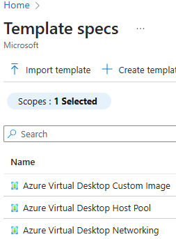

2. Choose the **Azure Virtual Desktop Networking** Template Spec and click "Deploy"

    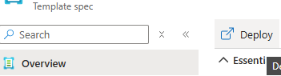

3. Populate the form with correct values. Use the the tool tips for more detailed parameter information.

    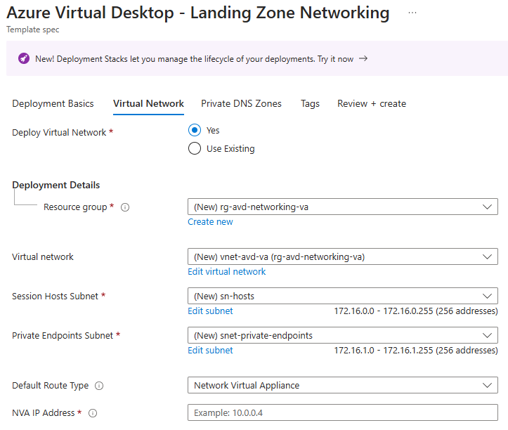

4. Once all values are populated, deploy the template. Parameter values and the template can be downloaded from the deployment view

If you do not wish to utilize the template spec to deploy the required networking, you can follow the instructions below to create the required networking components via PowerShell. These instructions assume a standalone network for deploying a Proof of Concept (be sure to updated the variable values).

1. Create a new resource group if one does not already exist:

    ``` powershell
    $Location       = '<Region>'
    $ResGroupName   = '<Resource Group Name>'
    New-AzResourceGroup -Location $Location -Name $ResGroupName
    ```

2. Create the VNet:

    ``` powershell
    $VnetName           = '<VNet Name>'
    $VnetAddressPrefix  = '10.0.0.0/16'
    $VirtualNetwork     = New-AzVirtualNetwork -Name $VnetName -ResourceGroupName $ResGroupName -Location $Location -AddressPrefix $VnetAddressPrefix
    ```

3. Create the virtual machine subnet configuration:

   ``` powershell
   $SubnetName          = '<Virtual Machine Subnet Name>'
   $SubnetAddressPrefix = '10.0.0.0/24'
   $SubnetConfig        = Add-AzVirtualNetworkSubnetConfig -Name $SubnetName -VirtualNetwork $VirtualNetwork -AddressPrefix $SubnetAddressPrefix
   ```

4. Associate the subnet configuration to the virtual network:

   ``` powershell
   $VirtualNetwork | Set-AzVirtualNetwork
   ```

5. Retrieve the Subnet Resource Id:

   ``` powershell
   $VNet = Get-AzVirtualNetwork -Name $VnetName -ResourceGroupName $ResGroupName
   ($VNet.Subnets | Where-Object {$_.Name -eq "$SubnetName"}).Id
   ```

   Save the resource id of the subnet for use in the parameters files below as follows:

   1. imageBuild - 'subnetResourceId'
   2. hostpools = 'virtualMachineSubnetResourceId'

6. Create the private endpoint subnet configuration:

   ``` powershell
   $SubnetName          = '<Private Endpoint Subnet Name>'
   $SubnetAddressPrefix = '10.1.0.0/24'
   $SubnetConfig        = Add-AzVirtualNetworkSubnetConfig -Name $SubnetName -VirtualNetwork $VirtualNetwork -AddressPrefix $SubnetAddressPrefix
   ```

7. Associate the subnet configuration to the virtual network:

   ``` powershell
   $VirtualNetwork | Set-AzVirtualNetwork
   ```

8. Retrieve the Subnet Resource Id:

   ``` powershell
   $VNet = Get-AzVirtualNetwork -Name $VnetName -ResourceGroupName $ResGroupName
   ($VNet.Subnets | Where-Object {$_.Name -eq "$SubnetName"}).Id
   ```

   Save the resource id of the subnet for use in the parameters files below as follows:

   1. imageManagement - 'privateEndpointSubnetResourceId'
   2. imageBuild = 'privateEndpointSubnetResourceId'
   3. hostpools = 'managementAndStoragePrivateEndpointSubnetResourceId'

While utilizing a private endpoints is optional, it must be deployed in order to follow Zero Trust principles. Both the image management and AVD deployments can use private endpoints for the following:

- Image Management - Blob Storage Account
- Image Build - Blob Storage Account for logging customizations
- AVD Deployment - Azure Files for FSLogix profiles, Azure Key Vault for storing secrets and Customer Managed Keys, AVD Private Link, Azure Recovery Services, and the Function App deployed to increase premium storage account quotas.

Prior to running the Deploy-ImageManagement script, the Azure Blob private DNS zone should be created either in the portal, via the Azure Virtual Desktop Networking template spec, or through Powershell. See [DNS Prerequisites](#prerequisites) for the correct values per environment.:

``` powershell
$ResGroupName = '<Resource Group Name>'
$ZoneName = '<privateDNSZoneName>'
$Zone = New-AzPrivateDnsZone -Name $ZoneName -ResourceGroupName $ResGroupName
```

The zone then needs to be linked to the Virtual Network created above.

``` powershell
$VNet = Get-AzVirtualNetwork -Name $VnetName -ResourceGroupName $ResGroupName
$Link = New-AzPrivateDnsVirtualNetworkLink -ZoneName $ZoneName -ResourceGroupName $ResGroupName -Name "Blob-$VnetName-Link" -VirtualNetworkId $Vnet.Id
```

Retrieve the private DNS zone resource id using the following PowerShell command and save it for the 'azureBlobPrivateDnsZoneResourceId' the parameters below.

``` powershell
$Zone.ResourceId
```

#### Confidential VM Disk Encryption with Customer Managed Keys (Optional)

In order to deploy Virtual Machines with Confidential VM encryption and customer managed keys, you will need to create the 'Confidential VM Orchestrator' application in your tenant.

Use the following steps to complete this prerequisite.

1. Open PowerShell (perferably PowerShell 7 or later), and install the latest Az Modules.

   If you launched PowerShell (or pwsh) as an administrator, use the following command:

   ``` powershell
   Install-Module -Name Microsoft.Graph -AllowClobber -Force
   ```

   If you did not launch pwsh as an administrator, use the following command:

   ``` powershell
   Install-Module -Name Microsoft.Graph -AllowClobber -Force -Scope CurrentUser
   ```

1. From the same PowerShell (or pwsh) console, execute the following PowerShell commands replacing "your tenant ID" with the correct value.

   ``` powershell
   Connect-Graph -Tenant "your tenant ID" Application.ReadWrite.All
   New-MgServicePrincipal -AppId bf7b6499-ff71-4aa2-97a4-f372087be7f0 -DisplayName "Confidential VM Orchestrator"
   ```

You will then need to specify the objectId property of this new service principal in the 'confidentialVMOrchestratorObjectId' parameter for the AVD Host Pool Deployment. The parameters for this deployment are documented at [AVD Host Pool Parameters](#avd-host-pool-deployment-parameters).

### Deployment

#### Deploy Image Management Resources

If you plan to build custom images or to add custom software or run scripts during the deployment of your session hosts, you should deploy the image management resources to support Zero Trust. You can also chose not to deploy these resources, but the image build VM will need access to the Internet to download the source files required for installation/configuration.

The **deployments/Deploy-ImageManagement.ps1** script is the easiest way to ensure all necessary image management resources (scripts and installers and Compute Gallery for custom image option.) are present for the AVD deployment.

> [!Important]
> For Zero Trust deployments and other details, see [image management parameters](#avd-image-management-parameters) for an explanation of all the available parameters.

1. Set required parameters and make any optional updates desired in **deployments/imageManagement/parameters/imageManagement.parameters.json** file.

1. **[Optional]** If you wish to add any custom scripts or installers beyond what is already included in the artifacts directory [../.common/artifacts], then gather your installers and create a new folder inside the artifacts directory for each customizer or application. In the folder create or place one and only one PowerShell script (.ps1) that installs the application or performs the desired customization. For an example of the installation script and supporting files, see the *.common/artifacts/VSCode* folder. These customizations can be applied to the custom image via the [customizations] parameter.

1. **[Optional]** The `SkipDownloadingNewSources` switch parameter will disable the downloading of the latest installers (or other files) from the Internet (or other network) to enable an "evergreen" capability that helps you keep your images and session hosts up to date. If you wish to use this capability, update the Urls specified in the *.common/artifacts/downloads/parameters.json* file to match your network environment. You can also not depend on this automated capability and add source files directly to the appropriate location in the artifacts directory *.common/artifacts*. This directory is processed by zipping the contents of each child directory into a zip file and then all existing files in the root plus the zip files are added to the blob storage container in the Storage Account.

1. Open the PowerShell version where you installed the Az module above. If not already connected to your Azure Environment, then connect to the correct Azure Environment where "\<Environment\>" equals "AzureCloud", "AzureUSGovernment", "USNat", or "USSec".

    ``` powershell
    Connect-AzAccount -Environment <Environment>
    ```

1. Ensure that your context is configured with the subscription to where you want to deploy the image management resources.

    ``` powershell
    Set-AzContext -Subscription <subscriptionID>
    ```

1. Change directories to the **deployments** folder and execute the **Deploy-ImageManagement.ps1** script as follows:

    ``` powershell
    .\Deploy-ImageManagement.ps1 -DeployImageManagementResources -Location <Region> [-SkipDownloadingNewSources] [-TempDir <Temp directory for artifacts>] [-DeleteExistingBlobs] [-TeamsTenantType <TeamsTenantType>]
    ```

    This script:

    a. With the '-DeployImageManagementResources' switch, deploys the resources in the _deployments/imageManagement/imageManagement.bicep_ to create the following Azure resources in the Image Management resource group:

    - [Compute Gallery](https://learn.microsoft.com/en-us/azure/virtual-machines/azure-compute-gallery)
    - [Storage Account](https://learn.microsoft.com/en-us/azure/storage/common/storage-account-overview)
    - [Storage Account Blob Container](https://learn.microsoft.com/en-us/azure/storage/blobs/blob-containers-portal)
    - **[Optional]** [Storage Account Diagnostic Setting to LogAnalytics](https://learn.microsoft.com/en-us/azure/storage/blobs/monitor-blob-storage?tabs=azure-portal)
    - [User Assigned Managed Identity](https://learn.microsoft.com/en-us/entra/identity/managed-identities-azure-resources/overview)
    - [Necessary role assignments](https://learn.microsoft.com/en-US/Azure/role-based-access-control/role-assignments)
    - **[Optional]** [Private Endpoint](https://learn.microsoft.com/en-us/azure/private-link/private-endpoint-overview)

    b. With the '-DownloadNewSources' switch set, downloads new source files into a temporary directory, generates a text file containing file versioning information, and then copies those directories/files to the Artifacts directory overwriting any existing files.

    c. Compresses the contents of each subfolder in the Artifacts directory into a zip file into a second temporary directory. Copies any files in the root of the Artifacts directory into the same temporary directory.

    d. Uploads the contents of the temporary directory as individual blobs to the storage account blob container overwriting any existing blobs with the same name.

#### Create a Custom Image (optional)

A custom image may be required or desired by customers in order to pre-populate VMs with applications and settings.

This deployment can be done via Command Line or through a Template Spec UI in the Portal. The deployment is fully customizable using the parameters documented at [Image Build Parameters](#avd-image-build-parameters).

**Option 1: Using Command Line**

1. Create a parameters file (imageBuild.parameters.json) by referencing the [Image Build Parameters Reference](#avd-image-build-parameters).

2. Deploy the Image Build

    ``` powershell
    $Location = '<Region>'
    $DeploymentName = '<valid deployment name>'
    New-AzDeployment -Location $Location -Name $DeploymentName -TemplateFile '.\deployments\imageManagement\imageBuild\imageBuild.bicep' -TemplateParameterFile '.\deployments\imageManagement\imageBuild\parameters\imageBuild.parameters.json' -Verbose
    ```

**Option 2: Using a Template Spec and Portal Form**

1. Go to Template Specs in the Azure Portal.

    

2. Choose the **Azure Virtual Desktop Custom Image** Template Spec and click "Deploy"

    

3. Populate the form with correct values. Use the the tool tips for more detailed parameter information.

    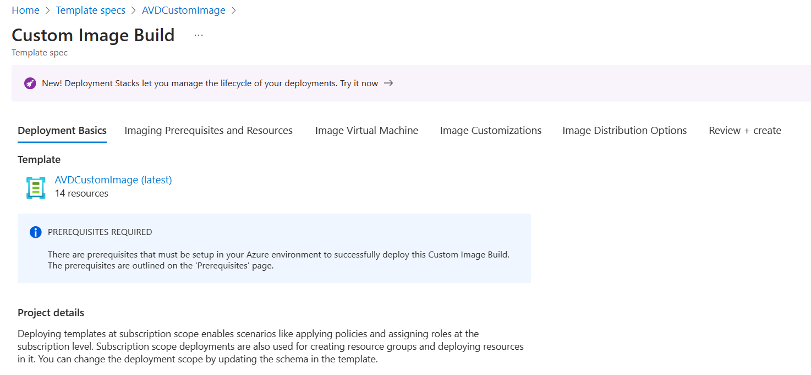

4. Once all values are populated, deploy the template. Parameter values and the template can be downloaded from the deployment view

#### Deploy an AVD Host Pool

The AVD solution includes all necessary resources to deploy a usable virtual desktop experience within Azure. This includes a host pool, application group, virtual machine(s) as well as other auxilary resources such as monitoring and profile management.

> [!Important]
> When choosing the settings for the source image, make sure that all settings are compatible or the build may fail. For example, choose a VM size that is compatible with the storage type (ie. Premium_LRS)

**Option 1: Using Command Line**

1. Create a parameters file (hostpoolid.parameters.json) by reviewing the documentation at [AVD Host Pool Parameters](#avd-host-pool-deployment-parameters).

2. Deploy the AVD Host Pool (and supporting resources)

    ``` powershell
    $Location = '<Region>'
    $DeploymentName = '<valid deployment name>'
    New-AzDeployment -Location $Location -Name $DeploymentName -TemplateFile '.\deployments\hostpools\hostpool.bicep' -TemplateParameterFile '.\deployments\hostpools\parameters\hostpoolid.parameters.json' -Verbose
    ```

**Option 2: Using a Template Spec and Portal Form**

1. Go to Template Specs in the Azure Portal

    

2. Choose the **Azure Virtual Desktop HostPool** Template Spec click "Deploy"

    

3. Populate the form with correct values. Use the table above or the tool tips for more detailed parameter information 

    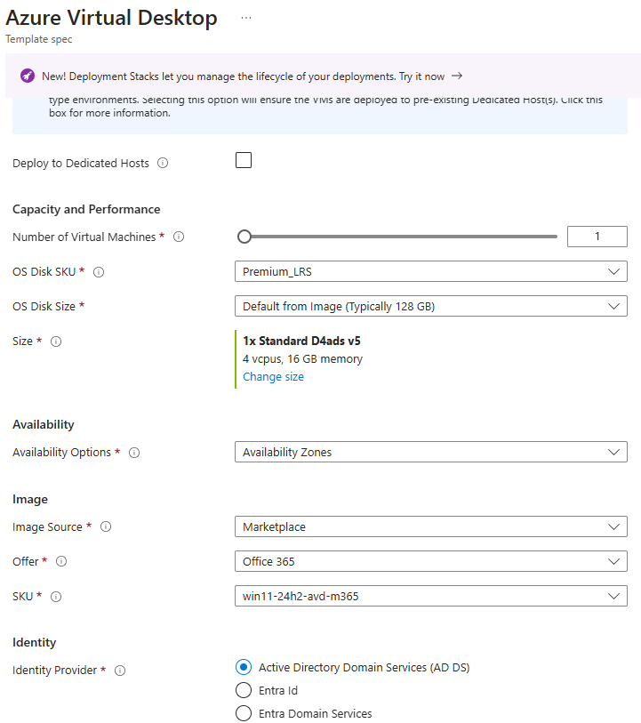

4. Once all values are populated, deploy the template. Parameter values and the template can be downloaded from the deployment view

### Validation

Once all resources have been deployed, the Virtual Machine should be accessible using [Windows Remote Desktop](https://learn.microsoft.com/en-us/azure/virtual-desktop/users/connect-windows?pivots=remote-desktop-msi) or through [AVD Web](https://aka.ms/avdweb) for Azure Commercial and [AVD Gov Web](https://aka.ms/avdgov) for Azure US Government.

The VM should appear and allow you to log in. Authentication depends on the identity solution supplied in the AVD Deployment step.

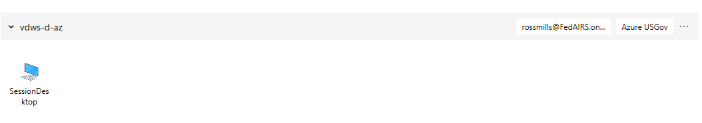

## Zero Trust Framework

### Executive Summary

The Azure Virtual Desktop (AVD) project represents a significant stride in the application of Zero Trust security principles within a cloud-based infrastructure. This article provides an overarching review of the Zero Trust framework as it is implemented in the AVD project, detailing how the design and deployment of the AVD solution aligns with the stringent security standards that Zero Trust advocates.

The article is structured into two major sections: an outline and a detailed section. The outline offers a concise overview of the key points, including the introduction of the AVD project, the Zero Trust principles, the project's design, its alignment with Zero Trust, and any deviations or special considerations. The detailed section then elaborates on each of these points, providing in-depth explanations and examples from the AVD  project to illustrate the practical application of Zero Trust principles.

By bridging the gap between high-level security strategies and their practical implementation, this article aims to serve as a valuable resource for organizations looking to enhance their security posture in the cloud. It underscores the importance of a Zero Trust approach in today's digital landscape and offers insights into the future of cloud security and the ongoing evolution of Zero Trust methodologies.

### Zero Trust and Azure Virtual Desktop (AVD) Project: An Overview

The Azure Virtual Desktop (AVD) Project represents an innovative deployment of virtual desktop infrastructure within the Azure cloud environment. This project is not just a testament to the flexibility and scalability of cloud solutions but also a showcase of the rigorous security framework that underpins modern cloud deployments: the Zero Trust model.

At its core, the AVD project is designed to deploy a fully operational AVD host pool and image management capability, automated to adhere to the Zero Trust principles. This approach is crucial in today's landscape where traditional security perimeters have dissolved, giving way to a more dynamic, distributed, and user-centric environment. The Zero Trust model operates on the premise that trust is never assumed and must always be verified, whether the request comes from inside or outside the network.

Incorporating Zero Trust into the AVD project means that every aspect of the deployment, from identity verification to device compliance and data protection, is scrutinized and secured. This project leverages Azure's robust security features, such as multifactor authentication, least privilege access, and end-to-end encryption, to ensure that every transaction is validated and trustworthy.

As we dive deeper into the AVD project, we will explore how the design and implementation of Zero Trust principles not only enhance security but also provide a seamless and efficient user experience. We will also discuss any deviations or specific considerations made for this project, underscoring the adaptability of the Zero Trust model to meet the unique requirements of the AVD deployment. Through this article, we aim to provide an overarching review of Zero Trust as it relates to the project, offering insights into the design choices and security implementations that make the AVD project a paragon of cloud-based virtual desktop solutions.

### Zero Trust Pinciples

The Zero Trust model is a comprehensive security approach essential in the design and deployment of the Azure Virtual Desktop (AVD) Project. This model is predicated on the belief that security must not be taken for granted, regardless of the location or perceived security of the network. The principles of Zero Trust are deeply embedded in the project's architecture, ensuring that every component, from identity verification to data protection, adheres to stringent security standards.

#### Verify

Every access request in the AVD project is treated with scrutiny, requiring explicit verification. This is achieved through:

- Multifactor authentication (MFA) to ensure robust identity validation.
- Conditional access policies that evaluate the context of each session.
- Continuous assessment of the trustworthiness of each request, even from within the network.

#### Use Least Privilege Access

- The principle of least privilege is rigorously applied to limit exposure to sensitive resources:
- Just-In-Time (JIT) and Just-Enough-Access (JEA) policies restrict access to what is necessary for the task at hand.
- Role-Based Access Control (RBAC) ensures that users have access only to the resources they need.
Segmentation of duties and micro-segmentation of the network further reduce the risk of unauthorized access.

#### Assume Breach

Operating under the assumption that a breach can occur, the AVD project is designed to minimize impact:

- End-to-end encryption safeguards data in transit and at rest.
- Analytics and threat detection mechanisms provide visibility and rapid response capabilities.
- Automated threat detection and response are implemented to address potential security incidents swiftly.

The AVD project's design reflects these principles through its use of the `businessUnitIdentifier` and `hostpoolIdentifier` to create a structured and secure resource hierarchy. The `centralizedAVDMonitoring` parameter allows for a unified security monitoring approach, enhancing the overall security posture.

Furthermore, the project’s design incorporates the Zero Trust principle of ‘least privilege access’ through its use of sharding to increase storage capacity. This approach ensures that each user assigned to the hostpool application groups only has access to one file share, thereby limiting their access and enhancing the security of the system. This means that a user can only access the data they need for their specific tasks and cannot access or modify data in other shards. This approach effectively limits each user's access, enhancing the security of the system by reducing the potential impact of a security breach. It also aligns with the Zero Trust principle of 'never trust, always verify' as each access request is treated as potentially risky and is therefore verified before access is granted.

In practice, the AVD project may deviate from standard Zero Trust practices to accommodate specific business needs or technical requirements. These deviations are carefully considered to maintain the integrity of the security model while providing the necessary flexibility for the project's success.

The AVD project adheres to Zero Trust as outlined in the "US Executive Order 14028: Executive Order on Improving the Nation’s Cybersecurity". This order emphasizes the need for a shift in cyber defense from a reactive to a proactive posture, requiring agencies to enhance cybersecurity and software supply chain integrity. The directive of the executive order that the project adheres to includes requiring service providers to share cyber incident and threat information, moving the Federal government to secure cloud services and zero-trust architecture, and establishing baseline security standards for development of software sold to the government. These directives align with the Zero Trust principles that the AVD project implements. However, specific project needs, or technical requirements may necessitate deviations from standard practices, which are carefully managed to maintain the project's security integrity.

The integration of Zero Trust principles within the AVD project is not just a security measure; it is a strategic decision that aligns with the evolving landscape of cloud computing and the increasing sophistication of cyber threats. As the project progresses, it will continue to serve as a benchmark for how Zero Trust can be effectively implemented in cloud-based virtual desktop solutions.

### AVD Design and Zero Trust

The design of the Azure Virtual Desktop (AVD) project is intrinsically linked to the principles of Zero Trust, ensuring that every aspect of the virtual desktop infrastructure is secure by default. The project's architecture incorporates several key features that align with Zero Trust principles:

#### Business Unit Identifier

The `businessUnitIdentifier` parameter plays a crucial role in resource segregation. It allows for the differentiation of resources across multiple business units within the same Azure subscription, ensuring that each unit's resources are isolated and secure.

#### Host Pool Identifer

The `hostpoolIdentifier` is a fundamental aspect of the AVD design, providing a unique identity to each host pool. This specificity is vital for applying granular security policies and access controls, adhering to the Zero Trust mandate of explicit verification.

#### Centralized AVD Monitoring

With the `centralizedAVDMonitoring` feature, the project can maintain a robust security posture by monitoring activities across all host pools. This centralized approach is essential for detecting and responding to potential security threats in real-time.

The AVD project includes several features that align with Zero Trust principles. One of these is the use of idempotent code, which means the core management resources are always updated and maintained consistently, no matter how many times the code is run. Another feature is the flexibility to deploy either personal or pooled host pools. Each type of host pool comes with its own set of security controls. These features help ensure that the project adheres to Zero Trust principles while meeting its specific needs.

### Zero Trust Implementation in AVD Offering

The AVD project's implementation of Zero Trust principles is a comprehensive approach that encompasses various aspects of the Azure Virtual Desktop environment. Here is how the project applies these principles:

#### Verification of Identities and Endpoints

- Multifactor Authentication (MFA): Ensures strong authentication for user-backed identities, eliminating password expirations and moving towards a password less environment.
- Device Health Validation: Requires all device types and operating systems to meet a minimum health state as a condition of access to any Microsoft resource.

#### Least Privilege Access

- Role-Based Access Control (RBAC): Confines access to session hosts and their data, allowing only necessary permissions to perform job functions.
- Just-In-Time and Just-Enough-Access (JIT/JEA): Limits user access based on risk-based adaptive policies and data protection, ensuring users have access only when needed and only to the extent required.

#### Breach Assumption and Segmentation

- Azure Firewall: Specifies allowed network traffic flows between hub and spoke VNets, preventing traffic flows between workloads.
- Defender for Storage: Provides automated threat detection and protection for storage resources.
- Encryption: Utilizes server-side encryption with customer managed keys and double encryption for end-to-end encryption of virtual machines.

#### Use of Azure Services to Enforce Zero Trust

- Azure Firewall: Manages and monitors network traffic flows, ensuring secure communication between components.
- Microsoft Defender for Servers: Offers threat detection capabilities for virtual machines.
- Azure Virtual Desktop Security Features: Includes governance, management, and monitoring features to improve defenses and collect session host analytics.

#### Deivations and Considerations

In the context of the AVD project, certain deviations and considerations have been made to tailor the Zero Trust principles to the solution's specific needs and architecture. These are outlined as follows:

#### Deviations from Standard Zero Trust Practices

- Confidential VMs and Trusted Launch: The project leverages Azure confidential VMs and Trusted Launch features to create a hardware-enforced boundary and protect virtual machines from advanced threats, going beyond typical Zero Trust security measures.

#### Project-Specific Considerations

- Business Unit Identifier: The use of the optional `businessUnitIdentifier` parameter allows for resource segregation and ensures that resources are appropriately named and managed within a shared subscription, aligning with the Zero Trust principle of least privilege access.
- Centralized AVD Monitoring: The choice between centralized monitoring and business unit-specific monitoring is a consideration that impacts the security posture and operational efficiency of the AVD deployment.
- Automated Features: The AVD project automates several features such as Auto Increase Premium File Share Quota, Backups, and Drain Mode. "Drain Mode" is a feature that, when deployed, puts the session hosts in a state where end users cannot access them until they have been validated. This aligns with the Zero Trust principle of "assume breach" by proactively managing resources and user access to maintain a secure environment. In other words, it is like a security guard double-checking everyone's ID at the door, even if they are already inside the building. It ensures that only the right people have access to the right resources at the right times, which helps keep the system secure.
- Attribute-Based Access Control (ABAC) Integration: With the future availability of ABAC, the AVD project can further enhance its security by providing more granular, attribute-based access control. This aligns well with the Zero Trust principles and can be integrated into the existing design and features of the solution. ABAC can help in verifying identities and endpoints, limiting user access, and assuming breach by minimizing the blast radius and segmenting access. It can also help reduce the number of role assignments and use attributes that have specific business meaning in access control.

These deviations and considerations demonstrate the project's commitment to adhering to Zero Trust principles while also addressing the unique requirements of the AVD solution. By carefully balancing security, usability, and cost-effectiveness, the project ensures a practical and secure deployment for end-users. The integration of Zero Trust within this Azure Virtual Desktop environment serves as a benchmark for future cloud security strategies.

### Conclusion

The AVD project stands as a testament to the practical application of Zero Trust principles within a cloud-based virtual desktop infrastructure. By meticulously integrating these principles into every layer of the AVD solution, from identity verification to data protection and device compliance, the project not only adheres to Microsoft's stringent security standards but also sets a new benchmark for cloud security.

The project's design and implementation highlight a deep understanding of the Zero Trust model, emphasizing the need to "never trust, always verify," and ensuring that every access request is thoroughly authenticated and authorized. The incorporation of advanced features such as Confidential VMs, Trusted Launch, and the idempotent nature of the deployment code further strengthens the security posture, allowing for a resilient and robust virtual desktop experience.

Looking ahead, the AVD project's alignment with Zero Trust principles will continue to evolve, reflecting the dynamic nature of cloud security and the ever-present need to adapt to emerging threats. As organizations increasingly move towards a mobile and distributed workforce, the lessons learned, and the strategies implemented in this project will serve as valuable blueprints for future deployments.

In conclusion, the AVD project not only delivers a secure and efficient virtual desktop solution but also exemplifies the effectiveness of a Zero Trust approach in protecting an organization's digital assets. It is a forward-thinking initiative that will undoubtedly inspire and guide subsequent endeavors in the realm of cloud computing and cybersecurity.

### References

- Azure Devops - AVD Repo
<https://dev.azure.com/AVDECIF/_git/AVD%20ECIF>
- Apply Zero Trust principles to an Azure Virtual Desktop deployment
<https://learn.microsoft.com/en-us/security/zero-trust/azure-infrastructure-avd>
- What is Zero Trust?
<https://learn.microsoft.com/en-us/security/zero-trust/zero-trust-overview>
- Implementing a Zero Trust security model at Microsoft
<https://www.microsoft.com/insidetrack/blog/implementing-a-zero-trust-security-model-at-microsoft/>
- What is Azure attribute-based access control (Azure ABAC)?
<https://learn.microsoft.com/en-us/azure/role-based-access-control/conditions-overview>  
- Zero Trust and the US Executive Order 14028 on Cybersecurity
<https://learn.microsoft.com/en-us/security/zero-trust/zero-trust-overview#zero-trust-and-the-us-executive-order-14028-on-cybersecurity>

## Troubleshooting

If you need to redeploy this solution due to an error or to add resources, be sure the virtual machines (aka session hosts) are turned on.  For "pooled" host pools, you must disable scaling as well.  If the virtual machines are shutdown, the deployment will fail since virtual machine extensions cannot be updated when virtual machines are in a shutdown state.

### WinError 193

[WinError 193] %1 is not a valid Win32 application
... missing tolower
Problem:
Corrupt Bizep Install
Solution:
az bicep uninstall
az bicep install
You might need to clear out the bicep exe which is located in the %USERPROFILE%.azure\bin\bicep.exe file.

## AVD Host Pool Deployment Parameters

### Required Parameters

| Parameter | Description | Type | Allowed | Default |
| --------- | ----------- | :--: | :-----: | ------- |
| `avdObjectId` | The Object ID for the Azure Virtual Desktop application in Entra Id with Application Id = '9cdead84-a844-4324-93f2-b2e6bb768d07'.  The Object ID can found by selecting Microsoft Applications using the Application type filter in the Enterprise Applications blade of Entra Id. If you use the custom UI and template spec, this value is obtained automatically. | string | object id | |
| `identifier` | An identifier used to distinquish each host pool. This normally represents the persona. | string | 3- 10 characters | |
| `identitySolution` | The service providing domain services for Azure Virtual Desktop.  This is needed to properly configure the session hosts and if applicable, the Azure Storage Account. | string | 'ActiveDirectoryDomainServices'<br/>'EntraDomainServices'<br/>'EntraId'<br/>'EntraIdIntuneEnrollment' | |
| `virtualMachineNamePrefix` | The prefix of the virtual machine name. Virtual Machines are named based on the prefix with the 3 character index incremented at the end (i.e., prefix001, prefix002, etc.) | string | 2 - 12 characters | |
| `virtualMachineSubnetResourceId` | The resource Id of the subnet onto which the Virtual Machines will be deployed. | string | resource id | |

## Conditional Parameters

| Parameter | Description | Type | Allowed | Default |
| --------- | ----------- | :--: | :-----: | ------- |

| `confidentialVMOrchestratorObjectId` | The object ID of the Confidential VM Orchestrator enterprise application with application ID "bf7b6499-ff71-4aa2-97a4-f372087be7f0". Required when `confidentialVMOSDiskEncryption` is set to true.  You must create this application in your tenant before deploying this solution using the powershell provided at https://learn.microsoft.com/en-us/azure/confidential-computing/quick-create-confidential-vm-portal#prerequisites. | string | object id | '' |
| `domainName` | The name of the domain that provides ADDS to the AVD session hosts and is synchronized with Azure AD. Required when `identitySolution` contains 'DomainServices'. | string | | '' |
| `domainJoinUserPrincipalName` | The User Principal Name of the user with the rights to join the computer to the domain in the specified OU path. Required when `identitySolution` contains 'DomainServices'. | secure string | either a secure string or a reference to a key vault following the guidance at https://learn.microsoft.com/en-us/azure/azure-resource-manager/templates/key-vault-parameter?tabs=azure-cli or see the Zero Trust example below. | '' |
| `domainJoinUserPassword` | The password of the user with the rights to join the computer to the domain in the specified OU path. Required when `identitySolution` contains 'DomainServices'. | secure string | either a secure string or a reference to a key vault following the guidance at https://learn.microsoft.com/en-us/azure/azure-resource-manager/templates/key-vault-parameter?tabs=azure-cli or see the Zero Trust example below. | '' |

| `managementPrivateEndpointSubnetResourceId` | The resource id of the subnet on which to create the management resource private endpoints. Required when the `managementPrivateEndpoints` parameter is set to true. | string | resource id | '' |
| `storagePrivateEndpointSubnetResourceId` | The resource id of the subnet on which the storage private endpoints will be attached. Required when the `storagePrivateEndpoints` parameter is set to true. | string | resource id | '' |
| `hostPoolPrivateEndpointSubnetResourceId` | The resource ID of the subnet where the AVD Private Link endpoints will be created. Required when `avdPrivateLinkPrivateRoutes` is not set to 'None'. | string | resource id | '' |
| `feedPrivateEndpointSubnetResourceId` | The resource ID of the subnet where the AVD Private Link endpoints will be created. Required when `avdPrivateLinkPrivateRoutes` is set to 'FeedAndHostPool' or 'All'. | string | resource id | '' |
| `globalFeedPrivateEndpointSubnetResourceId` | The resource ID of the subnet where the Global Feed AVD Private Link endpoint will be created. Required when `avdPrivateLinkPrivateRoutes` is set to 'All'. | string | resource id | '' |
| `virtualMachineAdminUserName` | The local administrator username. Required when not using the template spec ui. | secure string | either a secure string or a reference to a key vault following the guidance at https://learn.microsoft.com/en-us/azure/azure-resource-manager/templates/key-vault-parameter?tabs=azure-cli or see the Zero Trust example below. | '' |
| `virtualMachineAdminPassword` | The local administrator password. Required when not using the template spec ui. | secure string | either a secure string or a reference to a key vault following the guidance at https://learn.microsoft.com/en-us/azure/azure-resource-manager/templates/key-vault-parameter?tabs=azure-cli or see the Zero Trust example below. | '' |

## Optional Parameters

| Parameter | Description | Type | Allowed | Default |
| --------- | ----------- | :--: | :-----: | ------- |
| `azureFilesPrivateDnsZoneResourceId` | The resource Id of the Azure Files private DNS zone which is resolvable from the subnet where the session hosts are deployed. | string | resource id | '' |
| `azureKeyVaultPrivateDnsZoneResourceId` | The resource Id of the Azure Key Vault private dns zone which is resolvable from the subnet that the session hosts will be placed upon. | string | resource id | '' |
| `avdGlobalFeedPrivateDnsZoneResourceId` | If using private endpoints with Azure Virtual Desktop, input the Resource Id for the Private DNS Zone used for initial feed discovery. (privatelink-global.wvd.microsoft.com) | string | resource id | '' |
| `avdPrivateDnsZoneResourceId` | If using private endpoints with Azure Virtual Desktop, input the Resource ID for the Private DNS Zone used for feed download and connections to host pools. (privatelink.wvd.microsoft.com) | string | resource id | '' |
| `index` | A string of integers from 00 to 99. This parameter is designed to uniquely identify host pools when sharding of the host pool is necessary. | string | 0-99 | '' |
| `appGroupSecurityGroups` | An array of objects that contain the Entra ID DisplayNames and ObjectIds that are assigned to the desktop application group created by this template. If you do not shard storage, then these groups are also granted permissions to the storage accounts. | array (of objects) | [{"DisplayName":"Entra Display Name", "ObjectId": "Entra Object Id"}] | [] |
| `artifactsContainerUri` | The full URI of the storage account and container that contains any scripts you want to run on each host during deployment. | string | resource id | '' |
| `artifactsUserAssignedIdentityResourceId` | The resource ID of the managed identity with Storage Blob Data Reader Access to the artifacts storage Account. Required when the cseUris parameter is not empty. | string | resource id | '' |
| `availability` | Set the desired availability / SLA with a pooled host pool.  The best practice is to deploy to availability Zones for resilency. | string | 'none'<br/>'availabilitySets'<br/>'availabilityZones' | 'availabilityZones' |
| `avdAgentsModuleUri` | Sets the publically accessible download location for the Desired State Configuration zip file where the script and installers are located for the AVD Agents. This parameter may need to be updated periodically to ensure you are using the latest version. You can obtain this value by going through the Add new session host flow inside a host pool and showing the template and parameters. This value will be exposed in the parameters. | string | Allowed | url | https://wvdportalstorageblob.blob.${environment().suffixes.storage}/galleryartifacts/Configuration_*version*.zip | 
| `avdPrivateLinkPrivateRoutes` | Determines if Azure Private Link with Azure Virtual Desktop is enabled. Selecting "None" disables AVD Private Link deployment. Selecting one of the other options enables deployment of the required endpoints. See [AVD Private Link Setup](https://learn.microsoft.com/en-us/azure/virtual-desktop/private-link-setup?tabs=portal%2Cportal-2) for more information. | string | 'None'<br/>'HostPool'<br/>'FeedAndHostPool' | 'None' |
| `azureMonitorPrivateLinkScopeResourceId` | The resource Id of an existing Azure Monitor Private Link Scope resource. If specified, the log analytics workspace and data collection endpoint created by this solution will automatically be associated to this resource to configure private routing of Azure Monitor traffic. | string | valid resource Id | '' |
| `confidentialVMOSDiskEncryption` | Confidential disk encryption is an additional layer of encryption which binds the disk encryption keys to the virtual machine TPM and makes the disk content accessible only to the VM. | bool | true<br/>false | false |
| `customImageResourceId` | The resource ID for the Compute Gallery Image Version. Do not set this value if using a marketplace image. | string | resource id | '' |
| `dedicatedHostResourceId` | The resource Id of a specific Dedicated Host on which to deploy the Virtual Machines. This parameter takes precedence over the `dedicatedHostGroupResourceId` parameter. | string | resource id | '' |
| `dedicatedHostGroupResourceId` | The resource Id of the Dedicated Host Group on to which the Virtual Machines are to be deployed. The Dedicated Host Group must support Automatic Host Assignment for this value to be used. | string | resource id | '' |
| `deployFSLogixStorage` | Determines whether resources to support FSLogix profile storage are deployed. | bool | true<br/>true| false |
| `deployScalingPlan` | Determines if the scaling plan is deployed to the host pool. | bool | true<br/>false | false |
| `diskSizeGB` | The size of the session host OS disks. When set to 0, it defaults to the image size. | int | 0<br/>32<br/>64<br/>128<br/>256<br/>512<br/>1024<br/>2048<br/> | 0 |
| `enableAcceleratedNetworking` | Determines whether or not to enable accelerated networking on the session host vms. | bool | true<br/>false | true | 
| `existingFeedWorkspaceResourceId` | The resource Id of an existing AVD Workspace that you want to update with the new application group reference for the desktop application group. This parameter is required when deploying additional host pools to the same region and using the same businessUnitIdentifier or the workspace application groups will be overwritten with only the new application group reference. | string | valid resource id | '' |
| `fslogixAdminGroups` |  An array of objects, defining the administrator groups who will be granted full control access to the FSLogix share. The groups must exist in AD and Entra.<br/>Each object must include the following key value pairs:<br/>- 'displayName': The display name of the security group.<br/>- 'objectId': The Object ID of the security group. | array (of objects) | [{"displayName":"EntraGroupDisplayName","objectId":"guid"}] | [] |
| `fslogixEXistingLocalNetAppVolumeResourceIds` | Existing local (in the same region as the session host VMs) NetApp Files Volume Resource Ids. If Office Containers are used, then list the FSLogix Profile Container Volume first and the Office Container Volume second. Only used when `deployFSLogixStorage` = 'false', `fslogixConfigureSessionHosts` = 'true' and `fslogixStorageService` contains 'AzureNetAppFiles'. | array | [] |
| `fslogixEXistingLocalStorageAccountResourceIds` | Existing local (in the same region as the session host VMs) Azure Storage account Resource Ids. Only used when `deployFSLogixStorage` = 'false', `fslogixConfigureSessionHosts` = 'true' and `fslogixStorageService` contains 'AzureFilesFiles'. | array | [] |
| `fslogixEXistingRemoteNetAppVolumeResourceIds` | Existing remote (not in the same region as the session host VMs) NetApp Files Volume Resource Ids. If Office Containers are used, then list the FSLogix Profile Container Volume first and the Office Container Volume second. Only used when `fslogixConfigureSessionHosts` = 'true', `fslogixContainerType` contains 'CloudCache' and `fslogixStorageService` contains 'AzureNetAppFiles'. | array | [] |
| `fslogixEXistingRemoteStorageAccountResourceIds` | Existing remote (not in the same region as the session host VMs) Azure Storage Account Resource Ids. Only used when `fslogixConfigureSessionHosts` = 'true', `fslogixContainerType` contains 'CloudCache' and `fslogixStorageService` contains 'AzureFiles'. | array | [] |
| `fslogixShardOptions` |  Determines whether or not to Shard Azure Files Storage by deploying more than one storage account, and if so how the Session Hosts are Configured.<br/>If 'None' is selected, then no sharding is performed and only 1 storage account is deployed when deploying storage accounts.<br/>If 'ShardOSS' is selected, then the fslogixShardGroups are used to assign share permissions and configure the session hosts with Object Specific Settings.<br/>If 'ShardPerms' is selected, then storage account permissions are assigned based on the groups defined in `appGroupSecurityGroups` or `fslogixUserGroups`. | string | 'None'<br/>'ShardPerms'<br/>'ShardOSS' | 'None' |
| `fslogixUserGroups` |  An array of objects, defining the user groups who will be granted full control access to the FSLogix share. For `fslogixShardOptions`='ShardOSS' or `fslogixStorageService` contains 'AzureNetAppFiles' the groups must exist in AD and Entra. Otherwise, they can be Entra ID only groups.<br/>Each object must include the following key value pairs:<br/>- 'displayName': The display name of the security group.<br/>- 'objectId': The Object ID of the security group. | array (of objects) | [{"displayName":"EntraGroupDisplayName","objectId":"guid"}] | [] |
| `scalingPlanExclusionTag` | The tag used to exclude virtual machines from the scaling plan. | string | | '' |
| `desktopFriendlyName` | The friendly name for the Desktop in the AVD workspace. | string | | '' |
| `workspaceFriendlyName` | The friendly name of the AVD Workspace. This name is displayed in the AVD client. | string | | '' |
| `diskSku` | The storage SKU for the AVD session host disks.  Production deployments should use Premium_LRS. | string | 'Premium_LRS'<br/>'Standard_LRS'<br/>'StandardSSD_LRS' | 'Premium_LRS' |
| `diskSizeGB` | The size of the OS Disk. | int | 0<br/>64<br/>128<br/>256<br/>512<br/>1024<br/>2048 | 0 (Defaults to Image Size) |
| `domainJoinUserPassword` | The password of the privileged account to domain join the AVD session hosts to your domain | string (secure) | | '' |
| `domainJoinUserPrincipalName` | The UPN of the privileged account to domain join the AVD session hosts to your domain. This should be an account that resides within the domain you are joining. | string (secure) | | '' |
| `ouPath` | The distinguished name of the target Organizational Unit in Domain Services where the session hosts computer accounts will be located. | string | distinguished name | '' |
| `drainMode` | Enable drain mode on new sessions hosts to prevent users from accessing them until they are validated. | bool | true<br/>false | false |
| `enableMonitoring` | Deploys the required monitoring resources to enable AVD and VM Insights. | bool | true<br/>false | true |
| `encryptionAtHost` | Encryption at host encrypts temporary disks and ephemeral OS disks with platform-managed keys, OS and data disk caches with the key specified in the "keyManagementDisksAndStorage" parameter, and flows encrypted to the Storage service. | bool | true<br/>false | true |
| `existingGlobalFeedResourceId` | The resource Id of the existing global feed workspace. If provided, then the global feed will not be deployed/redeployed regardless of the settings specified in `avdPrivateLinkPrivateRoutes` | string | string | '' |
| `fslogixConfigureSessionHosts` | Configure FSLogix agent on the session hosts via local registry keys. Only applicable when `identitySolution` is "EntraId" or "EntraIdIntuneEnrollment". | bool | true<br/>false | false |
| `fslogixContainerType` | The type of FSLogix containers to use for FSLogix. | string | 'CloudCacheProfileContainer'<br/>'CloudCacheProfileOfficeContainer'<br/>'ProfileContainer'<br/>'ProfileOfficeContainer' | 'ProfileContainer' |
| `fslogixNetAppVnetResourceId` | The resource Id of the Virtual Network delegated for NetApp Volumes. Required when `fslogixStorageService` contains 'AzureNetAppFiles'. | string | resource id | '' |
| `fslogixShareSizeInGB` | The file share size(s) in GB for the fslogix storage solution. | int | | 100 |
| `fslogixStorageAccountADKerberosEncryption` | The Active Directory computer object Kerberos encryption type for the Azure Storage Account or Azure NetApp files Account. | string | 'AES256'<br/>'RC4' | 'AES256' |
| `fslogixStorageCustomPrefix` | The custom prefix to use for the name of the Azure files storage accounts to use for FSLogix. If not specified, the name is generated automatically. | string | max length 13 | '' |
| `fslogixStorageIndex` | The starting number for the storage accounts to support the required use case for FSLogix. https://docs.microsoft.com/en-us/azure/architecture/patterns/sharding | int | 0 to 99 | 1 |
| `fslogixStorageService` | The storage service to use for storing FSLogix containers. The service & SKU should provide sufficient IOPS for all of your users. https://docs.microsoft.com/en-us/azure/architecture/example-scenario/wvd/windows-virtual-desktop-fslogix#performance-requirements | string | 'AzureNetAppFiles Premium'<br/>'AzureNetAppFiles Standard'<br/>'AzureFiles Premium'<br/>'AzureFiles Standard' | 'AzureFiles Standard' |
| `globalFeedPrivateEndpointSubnetResourceId` | The resource ID of the subnet where the global feed private endpoint will be created for AVD Private Link. | string | resource id | '' |
| `workspacePublicNetworkAccess` | Determines if the AVD Workspace allows public network access when using AVD Private link. Applicable when `avdPrivateLinkPrivateRoutes` is set to 'FeedAndHostPool' or 'All'. 'Enabled' allows the global AVD feed to be accessed from both public and private networks, 'Disabled' allows this resource to only be accessed via private endpoints. | string | 'Disabled'<br/>'Enabled' | 'Enabled' |
| `hibernationEnabled` | Hibernation allows you to pause VMs that aren't being used and save on compute costs where the VMs don't need to run 24/7. | bool | true<br/>false | false |
| `hostPoolMaxSessionLimit` | The maximum number of sessions per AVD session host. | int | | 4 |
| `hostPoolPublicNetworkAccess` | Applicable only when `avdPrivateLinkPrivateRoutes` is not set to 'None'. Allow public access to the hostpool through the control plane. 'Enabled' allows this resource to be accessed from both public and private networks. 'Disabled' allows this resource to only be accessed via private endpoints. 'EnabledForClientsOnly' allows this resource to be accessed only when the session hosts are configured to use private routes. | string | 'Disabled'<br/>'Enabled'<br/>'EnabledForClientsOnly' | 'Enabled' |
| `hostPoolRDPProperties` | The RDP properties to add or remove RDP functionality on the AVD host pool. Settings reference: https://learn.microsoft.com/windows-server/remote/remote-desktop-services/clients/rdp-files | string | | 'audiocapturemode:i:1;camerastoredirect:s:*;enablerdsaadauth:i:1' |
| `hostPoolType` | These options specify the host pool type and depending on the type provides the load balancing options and assignment types. | string | 'Pooled DepthFirst'<br/>'Pooled BreadthFirst'<br/>'Personal Automatic'<br/>'Personal Direct' | 'Pooled DepthFirst' |
| `hostPoolValidationEnvironment` | The value determines whether the hostPool should receive early AVD updates for testing. | bool | true<br/>false| false |
| `imageOffer` | Offer for the virtual machine image. Required if `customImageResourceId` is not specified. | string | valid marketplace offer | 'office-365' |
| `imagePublisher` | Publisher for the virtual machine image. Required if `customImageResourceId` is not specified. | string | valid marketplace publisher | 'MicrosoftWindowsDesktop' |
| `imageSku` | SKU for the virtual machine image. Required if `customImageResourceId` is not specified. | string | valid marketplace sku | 'win11-23h2-avd-m365' |
| `integrityMonitoring` | Integrity monitoring enables cryptographic attestation and verification of VM boot integrity along with monitoring alerts if the VM didn't boot because attestation failed with the defined baseline. | bool | true<br/>false | true |
| `keyManagementDisks` | The type of encryption key management used for the OS disk. | string | 'PlatformManaged'<br/>'CustomerManaged'<br/>'<br/>'CustomerManagedHSM'<br/>'PlatformManagedAndCustomerManaged'<br/>'PlatformManagedAndCustomerManagedHSM' | 'PlatformManaged' |
| `keyManagementStorageAccounts` | The type of encryption key management used for the FSLogix storage accounts | string | 'MicrosoftManaged'<br/>'CustomerManaged'<br/>'CustomerManagedHSM' | 'MicrosoftManaged' |
| `managementPrivateEndpoints` | Determines if private endpoints are created for all management resources (i.e., Automation Accounts, Key Vaults) | bool | true<br/>false | false |
| `managementPrivateEndpointSubnetResourceId` | The resource id of the subnet on which to create the management resource private endpoints. | string | resource id | '' |
| `storagePrivateEndpoints` | Determines if private endpoints are created for all storage resources. | bool | true<br/>false | false |
| `nameConvResTypeAtEnd` | Reverse the normal Cloud Adoption Framework naming convention by putting the resource type abbreviation at the end of the resource name. | bool | true<br/>false | false |
| `regionControlPlane` | The deployment location for the AVD Control Plane resources (i.e., Host Pool, Workspace, and Application Group). Is not used if you specify an existing `workspaceResourceId`. | string | valid region | deployment.location |
| `secureBootEnabled` | Secure boot helps protect your VMs against boot kits, rootkits, and kernel-level malware. | bool | true<br/>false | true |
| `securityLogAnalyticsWorkspaceResourceId` | The resource Id of an existing Log Analytics workspace for security monitoring. Setting this value will install the legacy Microsoft Monitoring Agent (Log Analytics Agent) on the Virtual Machines and connect it to this workspace for log collection. | string | resource id | '' |
| `securityDataCollectionRulesResourceId` | The resource Id of an existing data collection rule designed to collect security relevant logs into a centralized Log Analytics workspace. Setting this value will install the Azure Monitor Agent on each virtual machine and associate the machine with the data collection rule. | string | resource id | '' |
| `securityType` | The Security Type of the Azure Virtual Machine. | string | 'Standard'<br/>'TrustedLaunch'<br/>'ConfidentialVM' | 'TrustedLaunch' |
| `sessionHostCustomizations` | An array of objects containing the customization scripts or application you want to run on each session host virtual machine. Each object must contain the 'name' and 'blobNameOrUri' properties and optionally an 'arguments' property that defines the script or installer arguments. | array (of objects) | | [] |
| `vTpmEnabled` | Virtual Trusted Platform Module (vTPM) is TPM2.0 compliant and validates your VM boot integrity apart from securely storing keys and secrets. | bool | true<br/>false | true |
| `workspaceResourceId` | The resource Id of an existing Azure Virtual Desktop Workspace that will be updated with the new desktop application group. If specified, then the `regionControlPlane` is not used and instead the region and resource group where this workspace is located is used. | string | resource id | '' |

## UI Generated / Automatic Parameters

| Parameter | Description | Type | Allowed | Default |
| --------- | ----------- | :--: | :-----: | ------- |
| `virtualMachineAdminPwdKvReference` | This parameter is only used by the UI deployment when selecting KeyVault as the source of the Virtual Machine Admin Username and Password. Although this can be used with a normal template deployment, it is recommended to use the regular reference object for the `virtualMachineAdminPassword` parameter. | Object | {"id":"KeyVaultResourceId","secretName":"secretName"} | {}
| `virtualMachineAdminUserNameKvReference` | This parameter is only used by the UI deployment when selecting KeyVault as the source of the Virtual Machine Admin UserName and Password. Although this can be used with a normal template deployment, it is recommended to use the regular reference object for the `virtualMachineAdminUserName` parameter. | Object | {"id":"KeyVaultResourceId","secretName":"secretName"} | {}
| `domainJoinUserPwdKvReference` | This parameter is only used by the UI deployment when selecting KeyVault as the source of the domain join credentials. Although this can be used with a normal template deployment, it is recommended to use the regular reference object for the `domainJoinUserPassword` parameter. | Object | {"id":"KeyVaultResourceId","secretName":"secretName"} | {}
| `domainJoinUserPrincipalNameKvReference`| This parameter is only used by the UI deployment when selecting KeyVault as the source of the domain join credentials. Although this can be used with a normal template deployment, it is recommended to use the regular reference object for the `domainJoinUserPrincipalName` parameter. | Object | {"id":"KeyVaultResourceId","secretName":"secretName"} | {}
| `timeStamp` | This value is automatically generated by the template when deployed and should not be provided or modified. | string | string | utc date time in yyyyMMddhhmmss format |

## Examples

### Required Parameters Only

This instance deploys an AVD host pool with default values.

``` json
{
    "$schema": "https://schema.management.azure.com/schemas/2019-04-01/deploymentParameters.json#",
    "contentVersion": "1.0.0.0",
    "parameters": {
        "avdObjectId": {
            "value": "xxxxxxxx-xxxx-xxxx-xxxx-xxxxxxxxxxxx"
        },
        "identifier": {
            "value": "admin"
        },
        "identitySolution": {
            "value": "EntraId"
        },
        "virtualMachineNamePrefix": {
            "value": "avd-hp1-eus-"
        },
        "virtualMachineAdminUserName": {
            "value": "avdAdmin"
        },
        "virtualMachineAdminPassword": {
            "value": "<REDACTED>"
        },
        "virtualMachineSubnetResourceId": {
            "value": "/subscriptions/xxxxxxxx-xxxx-xxxx-xxxx-xxxxxxxxxxxx/resourceGroups/rg-avd-networking-eastus/providers/Microsoft.Network/virtualNetworks/vnet-avd-eastus/subnets/hosts"
        }            
    }
}
```

### Zero Trust Compliant

This example shows a Zero Trust Compliant host pool that includes AVD Private Link, private endpoints for the key vault, automation account, and storage accounts. In addition, all secrets are retrieved from an existing Key Vault.

``` json
{
    "$schema": "https://schema.management.azure.com/schemas/2019-04-01/deploymentParameters.json#",
    "contentVersion": "1.0.0.0",
    "parameters": {
        // required
        "avdObjectId": {
            "value": "xxxxxxxx-xxxx-xxxx-xxxx-xxxxxxxxxxxx"
        },
        "identifier": {
            "value": "admin"
        },
        "identitySolution": {
            "value": "EntraId"
        },            
        "virtualMachineSubnetResourceId": {
            "value": "/subscriptions/xxxxxxxx-xxxx-xxxx-xxxx-xxxxxxxxxxxx/resourceGroups/rg-avd-networking-eastus/providers/Microsoft.Network/virtualNetworks/vnet-avd-eastus/subnets/hosts"
        },
        "virtualMachineNamePrefix": {
            "value": "avd-hp1-eus-"
        },
        // Get Secrets from a Key Vault (Optional)
        "virtualMachineAdminUserName": {
            "reference": {
                "keyVault": {
                    "id": "/subscriptions/xxxxxxxx-xxxx-xxxx-xxxx-xxxxxxxxxxxx/resourceGroups/rg-y5-admin-avd-management-use/providers/Microsoft.KeyVault/vaults/kv-y5-admin-sec-use"
                },
                "secretName": "virtualMachineAdminUserName"
            }
        },
        "virtualMachineAdminPassword": {
            "reference": {
                "keyVault": {
                    "id": "/subscriptions/xxxxxxxx-xxxx-xxxx-xxxx-xxxxxxxxxxxx/resourceGroups/rg-y5-admin-avd-management-use/providers/Microsoft.KeyVault/vaults/kv-y5-admin-sec-use"
                },
                "secretName": "virtualMachineAdminPassword"
            }
        },    
        // Storage Private Endpoints (required)
        "deployFSLogix": {
            "value": true
        },
        "storagePrivateEndpoints": {
            "value": true
        },
        "storagePrivateEndpointSubnetResourceId": {
            "value": "/subscriptions/xxxxxxxx-xxxx-xxxx-xxxx-xxxxxxxxxxxx/resourceGroups/rg-avd-networking-eastus/providers/Microsoft.Network/virtualNetworks/vnet-avd-eastus/subnets/privateEndpoints"
        },            
        "azureFilesPrivateDnsZoneResourceId": {
            "value": "/subscriptions/xxxxxxxx-xxxx-xxxx-xxxx-xxxxxxxxxxxx/resourceGroups/rg-networking-lab-eus/providers/Microsoft.Network/privateDnsZones/privatelink.file.core.windows.net"
        },
        // Management Private Endpoints (required)
        "managementPrivateEndpoints": {
            "value": true
        },                        
        "managementPrivateEndpointSubnetResourceId": {
            "value": "/subscriptions/xxxxxxxx-xxxx-xxxx-xxxx-xxxxxxxxxxxx/resourceGroups/rg-avd-networking-eastus/providers/Microsoft.Network/virtualNetworks/vnet-avd-eastus/subnets/privateEndpoints"
        },            
        // AVD Private Link (optional)
        "avdPrivateLinkPrivateRoutes": {
            "value": "All"
        },
        "globalFeedPrivateEndpointSubnetResourceId": {
            "value": "/subscriptions/xxxxxxxx-xxxx-xxxx-xxxx-xxxxxxxxxxxx/resourceGroups/rg-hub-networking-eastus/providers/Microsoft.Network/virtualNetworks/vnet-hub-eastus/subnets/privateEndpoints"
        },
        "hostPoolPrivateEndpointSubnetResourceId": {
            "value": "/subscriptions/xxxxxxxx-xxxx-xxxx-xxxx-xxxxxxxxxxxx/resourceGroups/rg-avd-networking-eastus/providers/Microsoft.Network/virtualNetworks/vnet-avd-eastus/subnets/privateEndpoints"
        },
        "feedPrivateEndpointSubnetResourceId": {
            "value": "/subscriptions/xxxxxxxx-xxxx-xxxx-xxxx-xxxxxxxxxxxx/resourceGroups/rg-hub-networking-eastus/providers/Microsoft.Network/virtualNetworks/vnet-hub-eastus/subnets/privateEndpoints"
        },
        "avdGlobalFeedPrivateDnsZoneResourceId": {
            "value": "/subscriptions/xxxxxxxx-xxxx-xxxx-xxxx-xxxxxxxxxxxx/resourceGroups/rg-avd-networking-eastus/providers/Microsoft.Network/privateDnsZones/privatelink-global.wvd.microsoft.com"
        },
        "avdPrivateDnsZoneResourceId": {
            "value": "/subscriptions/xxxxxxxx-xxxx-xxxx-xxxx-xxxxxxxxxxxx/resourceGroups/rg-avd-networking-eastus/providers/Microsoft.Network/privateDnsZones/privatelink.wvd.microsoft.com"
        },
        "hostPoolPublicNetworkAccess": {
            "value": "Disabled"
        },
        "workspacePublicNetworkAccess": {
            "value": "Disabled"
        }
    }
}
```

### Shard FSLogix Storage with Permissions

This example deploys an AVD host pool with Virtual Machines joined to an Active Directory domain and two user groups assigned to the host pool to allow two different storage accounts to be used for user profile storage.

``` json
{
    "$schema": "https://schema.management.azure.com/schemas/2019-04-01/deploymentParameters.json#",
    "contentVersion": "1.0.0.0",
    "parameters": {
        // required
        "avdObjectId": {
            "value": "xxxxxxxx-xxxx-xxxx-xxxx-xxxxxxxxxxxx"
        },
        "identifier": {
            "value": "admin"
        },
        // must use Domain Services to Shard Storage
        "identitySolution": {
            "value": "ActiveDirectoryDomainServices"
        },
        "virtualMachineNamePrefix": {
            "value": "avd-hp1-eus-"
        },
        "virtualMachineAdminUserName": {
            "value": "avdAdmin"
        },
        "virtualMachineAdminPassword": {
            "value": "<REDACTED>"
        },            
        "virtualMachineSubnetResourceId": {
            "value": "/subscriptions/xxxxxxxx-xxxx-xxxx-xxxx-xxxxxxxxxxxx/resourceGroups/rg-avd-networking-eastus/providers/Microsoft.Network/virtualNetworks/vnet-avd-eastus/subnets/hosts"
        },
        "domainName": {
            "value": "contoso.com"
        },
        "ouPath": {
            "value": "OU=East,OU=AVD,DC=contoso,DC=com"
        },
        "domainJoinUserPrincipalName": {
            "value": "domjoin@contoso.com"
        },
        "domainJoinUserPassword": {
            "value": "<REDACTED>"
        },
        "deployFSLogix": {
            "value": true
        },
        "appGroupSecurityGroups": {
            "value": [
                {
                    "name": "AVD_Users",
                    "objectId": "xxxxxxxx-xxxx-xxxx-xxxx-xxxxxxxxxxxx"
                }
            ]
        },
        "fslogixShardOptions": {
            "value": "ShardOSS"
        },
        "fslogixUserGroups": {
            "value": [
                {
                    "name": "AVD_East_Storage_1_Users",
                    "objectId": "xxxxxxxx-xxxx-xxxx-xxxx-xxxxxxxxxxxx"
                },
                {
                    "name": "AVD_East_Storage_2_Users",
                    "objectId": "xxxxxxxx-xxxx-xxxx-xxxx-xxxxxxxxxxxx"
                }
            ]
        }
    }
}
```

### Enable Scaling Plan

This instance deploys a scaling plan and associates it with the host pool.

``` json
{
    "$schema": "https://schema.management.azure.com/schemas/2019-04-01/deploymentParameters.json#",
    "contentVersion": "1.0.0.0",
    "parameters": {
        // required
        "avdObjectId": {
            "value": "xxxxxxxx-xxxx-xxxx-xxxx-xxxxxxxxxxxx"
        },
        "artifactsStorageAccountResourceId": {
            "value": "/subscriptions/xxxxxxxx-xxxx-xxxx-xxxx-xxxxxxxxxxxx/resourceGroups/rg-avd-image-management-use/providers/Microsoft.Storage/storageAccounts/saimageassetsusexj5oy5dp"
        },
        "identifier": {
            "value": "admin"
        },
        "identitySolution": {
            "value": "EntraId"
        },
        "virtualMachineNamePrefix": {
            "value": "avd-hp1-eus-"
        },
        "virtualMachineAdminUserName": {
            "value": "avdAdmin"
        },
        "virtualMachineAdminPassword": {
            "value": "<REDACTED>"
        },            
        "virtualMachineSubnetResourceId": {
            "value": "/subscriptions/xxxxxxxx-xxxx-xxxx-xxxx-xxxxxxxxxxxx/resourceGroups/rg-avd-networking-eastus/providers/Microsoft.Network/virtualNetworks/vnet-avd-eastus/subnets/hosts"
        },
        // Scaling Plan
        "deployScalingPlan": {
            "value": true
        },
        "scalingPlanExclusionTag": {
            "value": "ExcludedFromScaling"
        },
        "scalingPlanRampUpSchedule": {
            "value": {
                "startTime": "8:00",
                "minimumHostsPct": 20,
                "capacityThresholdPct": 60,
                "loadBalancingAlgorith": "BreadthFirst"
            }
        },
        "scalingPlanPeakSchedule": {
            "value": {
                "startTime": "9:00",
                "loadBalancingAlgorithm": "BreadthFirst"
            }
        },
        "scalingPlanRampDownSchedule": {
            "value": {
                "startTime": "17:00",
                "minimumHostsPct": 10,
                "capacityThresholdPct": 90,
                "loadBalancingAlgorith": "DepthFirst"
            }
        },
        "scalingPlanOffPeakSchedule": {
            "value": {
                "startTime": "20:00",
                "loadBalancingAlgorithm": "DepthFirst"
            }
        }
    }
}
```

### IL5 Isolation Requirements on IL4

This example shows a deployment to Azure US Government Regions which are IL4 that meets the isolation guidelines for IL5 workloads. This deployment includes Dedicated Hosts and Customer Managed Keys for the Virtual Machines and FSLogix Storage Accounts.

> [!Note]
> The `virtualMachineSize` must be compatible with the Dedicated Host (or one of the Dedicated Hosts in the Dedicated Host Group).

```json
{
    "$schema": "https://schema.management.azure.com/schemas/2019-04-01/deploymentParameters.json#",
    "contentVersion": "1.0.0.0",
    "parameters": {
        // required
        "avdObjectId": {
            "value": "xxxxxxxx-xxxx-xxxx-xxxx-xxxxxxxxxxxx"
        },
        "identifier": {
            "value": "IL5"
        },
        "identitySolution": {
            "value": "EntraId"
        },            
        "virtualMachineSubnetResourceId": {
            "value": "/subscriptions/xxxxxxxx-xxxx-xxxx-xxxx-xxxxxxxxxxxx/resourceGroups/rg-avd-networking-usgva/providers/Microsoft.Network/virtualNetworks/vnet-avd-usgva/subnets/hosts"
        },
        "virtualMachineNamePrefix": {
            "value": "avd-il5-usgva-"
        },
        "virtualMachineAdminUserName": {
            "value": "avdAdmin"
        },
        "virtualMachineAdminPassword": {
            "value": "<REDACTED>"
        },
        "virtualMachineSize": {
            "value": "Standard_D4ads_v5"
        },
        // Storage Private Endpoints
        "deployFSLogix": {
            "value": true
        },
        "storagePrivateEndpoints": {
            "value": true
        },
        "storagePrivateEndpointSubnetResourceId": {
            "value": "/subscriptions/xxxxxxxx-xxxx-xxxx-xxxx-xxxxxxxxxxxx/resourceGroups/rg-avd-networking-usgva/providers/Microsoft.Network/virtualNetworks/vnet-avd-usgva/subnets/privateEndpoints"
        },            
        "azureFilesPrivateDnsZoneResourceId": {
            "value": "/subscriptions/xxxxxxxx-xxxx-xxxx-xxxx-xxxxxxxxxxxx/resourceGroups/rg-networking-usgva/providers/Microsoft.Network/privateDnsZones/privatelink.file.core.usgovcloudapi.net"
        },
        // Management Private Endpoints
        "managementPrivateEndpoints": {
            "value": true
        },                        
        "managementPrivateEndpointSubnetResourceId": {
            "value": "/subscriptions/xxxxxxxx-xxxx-xxxx-xxxx-xxxxxxxxxxxx/resourceGroups/rg-avd-networking-usgva/providers/Microsoft.Network/virtualNetworks/vnet-avd-usgva/subnets/privateEndpoints"
        },            
        "azureKeyVaultPrivateDnsZoneResourceId": {
            "value": "/subscriptions/xxxxxxxx-xxxx-xxxx-xxxx-xxxxxxxxxxxx/resourceGroups/rg-networking-usgva/providers/Microsoft.Network/privateDnsZones/privatelink.vaultcore.usgovcloudapi.net"
        },
        // Encryption At Rest (Storage Isolation Requirements)
        "keyManagementDisks": {
            "value": "PlatformManagedAndCustomerManagedHSM"
        },
        "keyManagementStorageAccounts": {
            "value": "CustomerManagedHSM"
        },
        // Dedicated Hosts (Compute Isolation Requirements)
        "dedicatedHostGroupResourceId": {
            "value": "/subscriptions/xxxxxxxx-xxxx-xxxx-xxxx-xxxxxxxxxxxx/resourceGroups/rg-avd-hostgroups-usgva/providers/Microsoft.Compute/hostGroups/hg-avd-usgva-zone1"
        }
    }
}
```

## AVD Image Build Parameters

This template deploys a Storage Account with a blob container (optionally with a Private Endpoint) and an Azure Compute Gallery.

### Required Parameters

| Parameter | Description | Type | Allowed | Default |
| --- | --- | :---: | :---: | :---: |
| `artifactsContainerUri` | The full URI of the storage account and container that contains the artifacts used uring the custom image build. This storage account, container, and custom script blobs were uploaded with deploy-imagemanagement.ps1. | string | Uri | '' |
| `computeGalleryResourceId` | Azure Compute Gallery Resource Id. | string | resource id | |
| `storageAccountResourceId` | The resource Id of the storage account containing the artifacts (scripts, installers, etc) used during the image build. | string | resource id |  |
| `subnetResourceId` | The resource Id of the subnet to which the image build and management VMs will be attached. | string | resource id | |
| `userAssignedIdentityResourceId` | The resource Id of the user assigned managed identity used to access the storage account. | string | resource id | |
| `vmSize` | The size of the Image build and Management VMs. | string | valid vm size | |

### Conditional Parameters

| Parameter | Description | Type | Allowed | Default |
| --- | --- | :---: | :---: | :---: |
| `privateEndpointSubnetResourceId` | The resource id of the private endpoint subnet. Must be provided if `collectCustomizationLogs` is set to 'true'. | string | resource id | '' |
| `customImageDefinitionName` | The name of the image Definition to create in the Compute Gallery. Only valid if `imageDefinitionResourceId` is not provided. If left blank, the image definition name will be built on Cloud Adoption Framework principals and based on the `imageDefinitonPublisher`, `imageDefinitionOffer`, and `imageDefinitionSku` values. | string | up to 80 characters | '' |
| `imageDefinitionOffer` | The computer gallery image definition Offer. Required when the `imageDefinitionResourceId` is not defined. | string | up to 64 characters | '' |
| `imageDefinitionPublisher` | The compute gallery image definition Publisher. Required when the `imageDefinitionResourceId` is not defined. | string | up to 128 characters | '' |
| `imageDefinitionSku` | The compute gallery image definition Sku. Required when the `imageDefinitionResourceId` is not defined. | string | up to 64 characters | '' |
| `imageVersionDefaultRegion` | Specifies the default replication region when imageVersionTargetRegions is not supplied. | string | valid region | '' |
| `offer` | The Marketplace Image offer. Required when the `customSourceImageResourceId` is not defined. | string | valid marketplace offer | '' |
| `publisher` | The Marketplace Image publisher. Required when the `customSourceImageResourceId` is not defined. | string | valid marketplace publisher | '' |
| `sku` | The Marketplace Image sku. Required when the `customSourceImageResourceId` is not defined. | string | valid marketplace sku | '' |
| `wsusServer` | The WSUS Server Url if `installUpdates` is true and `updateService` is set to 'WSUS'. (i.e., https://wsus.corp.contoso.com:8531) | string | valid url | '' |

### Optional Parameters

| Parameter | Description | Type | Allowed | Default |
| --- | --- | :---: | :---: | :---: |
| `artifactsContainerName` | The name of the storage blob container which contains the artifacts (scripts, installers, etc) used during the image build. | string | lowercase string | 'artifacts' |
| `blobPrivateDnsZoneResourceId` | The resource id of the existing Azure storage account blob service private dns zone. This zone must be linked to or resolvable from the vnet referenced in the `privateEndpointSubnetResourceId` parameter. | string | resource id | '' |
| `collectCustomizationLogs` | Collect image customization logs. | bool | true<br/>false | false |
| `customBuildResourceGroupName` | The custom name of the resource group where the image build and management vms will be created. Leave blank to create a new resource group based on Cloud Adoption Framework naming principals. | string | valid resource group name | '' |
| `customSourceImageResourceId` | The resource Id of the source image to use for the image build. If not provided, the latest image from the specified publisher, offer, and sku will be used. | string | resource id | '' |
| `customizations` | This parameter is array of objects that define additional installations and customizations that will be applied to your image. Each object must contain a 'name' property and 'blobNameOrUri' property. In addition, you can specify any script or installer arguments in the 'arguments' property on each object. **Important**, the "blobNameOrUri" property value is case sensitive. | array (of objects) | | [] |
| `location` | Deployment location. Note that the compute resources will be deployed to the region where the subnet is located. | string | valid region | `deployment().location` |
| `encryptionAtHost` | Determines if "EncryptionAtHost" is enabled on the VMs. | bool | true<br/>false | true |
| `imageBuildResourceGroupId` | The resource Id of an existing resource group in which to create the vms to build the image. Leave blank to create a new resource group. | string | resource id | '' |
| `imageDefinitionIsAcceleratedNetworkSupported` | Specifies whether the image definition supports the deployment of virtual machines with accelerated networking enabled. | bool | true<br/>false | false |
| `imageDefinitionIsHibernateSupported` | Specifies whether the image definition supports creating VMs with support for hibernation. | bool | true<br/>false | false |
| `imageDefinitionIsHigherStoragePerformanceSupported` | Specifies whether the image definition supports capturing images of NVMe disks or Virtual Machines. | bool | true<br/>false | false |
| `imageDefinitionResourceId` | The resource id of an existing Image Definition in the Compute gallery. | string | resource id | '' |
| `imageDefinitionSecurityType` | The security type of the image definition. | string | 'Standard'<br/>'ConfidentialVM'<br/>'ConfidentialVMSupported'<br/>'TrustedLaunch'<br/>'TrustedLaunchSupported'<br/>'TrustedLaunchAndConfidentialVMSupported' | 'TrustedLaunch' |
| `imageMajorVersion` | The image major version from 0 - 9999. In order to specify a custom image version you must specify the [imageMajorVersion], [imageMinorVersion], and [imagePatch]. Leave the default to automatically generate the image version. | int | -1 to 9999 | -1 |
| `imageMinorVersion` | The image minor version from 0 - 9999. In order to specify a custom image version you must specify the [imageMajorVersion], [imageMinorVersion], and [imagePatch]. Leave the default to automatically generate the image version. | int | -1 to 9999 | -1 |
| `imagePatch` | The image patch version from 0 - 9999. In order to specify a custom image version you must specify the [imageMajorVersion], [imageMinorVersion], and [imagePatch]. Leave the default to automatically generate the image version. | int | -1 to 9999 | -1 |
| `imageVersionDefaultReplicaCount` | The default image version replica count per region. This can be overwritten by the regional value. | int | 1 to 100. | 1 |
| `imageVersionDefaultStorageAccountType` | Specifies the storage account type to be used to store the image. This property is not updatable. | string | 'Standard_LRS'<br/>'Premium_LRS'<br/>'Standard_ZRS' | 'Standard_LRS' |
| `imageVersionEOLinDays` | The number of days from now that the image version will reach end of life. | int | 0 to 720 | 0 |
| `imageVersionExcludeFromLatest` | Exclude this image version from the latest. This property can be overwritten by the regional value. | bool | true<br/>false | false |
| `imageVersionTargetRegions` | The regions to which the image version will be replicated. (Default: deployment location with Standard_LRS storage and 1 replica.) | array | array of valid regions | [] |
| `appsToRemove` | A list of the built-in Appx Packages to remove. | array |  | [] |
| `office365AppsToInstall` | A list of Office 365 ProPlus apps to install | array | Access</br>Excel<br/>PowerPoint<br/>OneNote<br/>Outlook<br/>Project<br/>Publisher<br/>SkypeForBusiness<br/>Vision<br/>Word | [] |
| `installFsLogix` | Install FSLogix Agent. | bool | true<br/>false | false |
| `installOneDrive` | Install OneDrive (Per Machine) | bool | true<br/>false | false |
| `installTeams` | Install Microsoft Teams. | bool | true<br/>false | false |
| `installUpdates` | Determines if the latest updates from the specified update service will be installed. | bool | true<br/>false | true |
| `installVirtualDesktopOptimizationTool` | Apply the Virtual Desktop Optimization Tool customizations. | bool | true<br/>false | false |
| `tags` | The tags to apply to all resources deployed by this template. | object | | {} |
| `updateService` | The update service. | string | 'WU'<br/>'MU'<br/>'WSUS'<br/>'DCAT'<br/>'STORE'<br/>'OTHER' | 'MU' |

## Examples

The following section provides usage examples for this template.

### Required Parameters Only

This instance builds an AVD image from the latest Windows AVD SKU without Office 365, performs no customizations, generates a new image definition based on the source image publisher, offer, and sku and creates a version in the deployment region.

```json
{
    "$schema": "https://schema.management.azure.com/schemas/2019-04-01/deploymentParameters.json#",
    "contentVersion": "1.0.0.0",
    "parameters": {
        "computeGalleryResourceId": {
            "value": "/subscriptions/xxxxxxxx-xxxx-xxxx-xxxx-xxxxxxxxxxxx/resourceGroups/rg-avd-image-management-use/providers/Microsoft.Compute/galleries/gal_image_management_use"
        },
        "storageAccountResourceId": {
            "value": "/subscriptions/xxxxxxxx-xxxx-xxxx-xxxx-xxxxxxxxxxxx/resourceGroups/rg-avd-image-management-use/providers/Microsoft.Storage/storageAccounts/saimageassetsusexj5oy5dp"
        },
        "subnetResourceId": {
            "value": "/subscriptions/xxxxxxxx-xxxx-xxxx-xxxx-xxxxxxxxxxxx/resourceGroups/rg-avd-networking-eastus/providers/Microsoft.Network/virtualNetworks/vnet-avd-eastus/subnets/hosts"
        },
        "userAssignedIdentityResourceId": {
            "value": "/subscriptions/xxxxxxxx-xxxx-xxxx-xxxx-xxxxxxxxxxxx/resourceGroups/rg-avd-image-management-use/providers/Microsoft.ManagedIdentity/userAssignedIdentities/uai-image-management-use"
        },
        "vmSize": {
            "value": "Standard_D4ads_v5"
        }
    }
}
```

### Additional Customizations

This instance builds an image that has LGPO and VS Code installed.

> [!Warning]
> The blobName is case sensitive.

```json
{
    "$schema": "https://schema.management.azure.com/schemas/2019-04-01/deploymentParameters.json#",
    "contentVersion": "1.0.0.0",
    "parameters": {
        "computeGalleryResourceId": {
            "value": "/subscriptions/xxxxxxxx-xxxx-xxxx-xxxx-xxxxxxxxxxxx/resourceGroups/rg-avd-image-management-use/providers/Microsoft.Compute/galleries/gal_image_management_use"
        },
        "storageAccountResourceId": {
            "value": "/subscriptions/xxxxxxxx-xxxx-xxxx-xxxx-xxxxxxxxxxxx/resourceGroups/rg-avd-image-management-use/providers/Microsoft.Storage/storageAccounts/saimageassetsusexj5oy5dp"
        },
        "subnetResourceId": {
            "value": "/subscriptions/xxxxxxxx-xxxx-xxxx-xxxx-xxxxxxxxxxxx/resourceGroups/rg-avd-networking-eastus/providers/Microsoft.Network/virtualNetworks/vnet-avd-eastus/subnets/hosts"
        },
        "userAssignedIdentityResourceId": {
            "value": "/subscriptions/xxxxxxxx-xxxx-xxxx-xxxx-xxxxxxxxxxxx/resourceGroups/rg-avd-image-management-use/providers/Microsoft.ManagedIdentity/userAssignedIdentities/uai-image-management-use"
        },
        "vmSize": {
            "value": "Standard_D4ads_v5"
        },
        "customizations": {
            "value": [
                {
                    "name": "LGPO",
                    "blobName": "LGPO.zip"
                },
                {
                    "name": "VSCode",
                    "blobName": "VSCode.zip",
                    "arguments": "/verysilent"
                }
            ]
        }
    }
}
```

### Install Updates via Windows Update

This instance creates and image using default settings and installs updates from a Windows Server Update Services instance.

```json
{
    "$schema": "https://schema.management.azure.com/schemas/2019-04-01/deploymentParameters.json#",
    "contentVersion": "1.0.0.0",
    "parameters": {
        "computeGalleryResourceId": {
            "value": "/subscriptions/xxxxxxxx-xxxx-xxxx-xxxx-xxxxxxxxxxxx/resourceGroups/rg-avd-image-management-use/providers/Microsoft.Compute/galleries/gal_image_management_use"
        },
        "storageAccountResourceId": {
            "value": "/subscriptions/xxxxxxxx-xxxx-xxxx-xxxx-xxxxxxxxxxxx/resourceGroups/rg-avd-image-management-use/providers/Microsoft.Storage/storageAccounts/saimageassetsusexj5oy5dp"
        },
        "subnetResourceId": {
            "value": "/subscriptions/xxxxxxxx-xxxx-xxxx-xxxx-xxxxxxxxxxxx/resourceGroups/rg-avd-networking-eastus/providers/Microsoft.Network/virtualNetworks/vnet-avd-eastus/subnets/hosts"
        },
        "userAssignedIdentityResourceId": {
            "value": "/subscriptions/xxxxxxxx-xxxx-xxxx-xxxx-xxxxxxxxxxxx/resourceGroups/rg-avd-image-management-use/providers/Microsoft.ManagedIdentity/userAssignedIdentities/uai-image-management-use"
        },
        "vmSize": {
            "value": "Standard_D4ads_v5"
        },
        "installUpdates": {
            "value": true
        },
        "updateService": {
            "value": "WSUS"
        },
        "wsusServer": {
            "value": "https://wsus.contoso.com:8531"
        }
    }
}
```

### New Image Definition and multiple region distribution

This instance creates a new image definition (with a name based on the provide Publisher, Offer, and Sku) in the Azure Compute Gallery and creates a version that is distributed to multiple regions. It also tags the image definition and image version.

``` json
{
    "$schema": "https://schema.management.azure.com/schemas/2015-01-01/deploymentParameters.json#",
    "contentVersion": "1.0.0.0",
    "parameters": {
        "computeGalleryResourceId": {
            "value": "/subscriptions/xxxxxxxx-xxxx-xxxx-xxxx-xxxxxxxxxxxx/resourceGroups/rg-avd-image-management-use/providers/Microsoft.Compute/galleries/gal_image_management_use"
        },
        "storageAccountResourceId": {
            "value": "/subscriptions/xxxxxxxx-xxxx-xxxx-xxxx-xxxxxxxxxxxx/resourceGroups/rg-avd-image-management-use/providers/Microsoft.Storage/storageAccounts/saimageassetsusexj5oy5dp"
        },
        "userAssignedIdentityResourceId": {
            "value": "/subscriptions/xxxxxxxx-xxxx-xxxx-xxxx-xxxxxxxxxxxx/resourceGroups/rg-avd-image-management-use/providers/Microsoft.ManagedIdentity/userAssignedIdentities/uai-image-management-use"
        },
        "subnetResourceId": {
            "value": "/subscriptions/xxxxxxxx-xxxx-xxxx-xxxx-xxxxxxxxxxxx/resourceGroups/rg-avd-networking-eastus/providers/Microsoft.Network/virtualNetworks/vnet-avd-eastus/subnets/default"
        },
        "vmSize": {
            "value": "Standard_D4ads_v5"
        }, 
        "publisher": {
            "value": "MicrosoftWindowsDesktop"
        },
        "offer": {
            "value": "office-365"
        },
        "sku": {
            "value": "win11-23h2-avd-m365"
        },
        "installUpdates": {
            "value": true
        },
        "updateService": {
            "value": "MU"
        },        
        "customImageDefinitionName": {
            "value": ""
        },
        "imageDefinitionPublisher": {
            "value": "Contoso"
        },
        "imageDefinitionOffer": {
            "value": "office-365"
        },
        "imageDefinitionSku": {
            "value": "win11-23h2-avd-m365"
        },
        "imageDefinitionIsAcceleratedNetworkSupported": {
            "value": true
        },
        "imageDefinitionIsHibernateSupported": {
            "value": true
        },
        "imageDefinitionIsHigherStoragePerformanceSupported": {
            "value": false
        },
        "imageDefinitionSecurityType": {
            "value": "TrustedLaunch"
        },        
        "imageVersionEOLinDays": {
            "value": 0
        },
        "imageVersionDefaultReplicaCount": {
            "value": 1
        },
        "imageVersionDefaultStorageAccountType": {
            "value": "Standard_LRS"
        },
        "imageVersionDefaultRegion": {
            "value": ""
        },
        "imageVersionExcludeFromLatest": {
            "value": false
        },
        "imageVersionTargetRegions": {
            "value": [
                {
                    "storageAccountType": "Standard_LRS",
                    "name": "eastus",
                    "regionalReplicaCount": "10"
                },
                {
                    "storageAccountType": "Standard_LRS",
                    "name": "westus",
                    "regionalReplicaCount": "10"
                },
                {
                    "storageAccountType": "Standard_LRS",
                    "name": "westcentralus",
                    "regionalReplicaCount": "10"
                }
            ]
        },
        "tags": {
            "value": {
                "Microsoft.Compute/galleries/images": {
                    "createdBy": "stmeyer"
                },
                "Microsoft.Compute/galleries/images/versions": {
                    "createdBy": "stmeyer"
                }
            }
        }
    }
}
```

## AVD Image Management Parameters

This template deploys a Storage Account with a blob container (optionally with a Private Endpoint) and an Azure Compute Gallery.

### Optional Parameters

| Parameter | Description | Type | Allowed | Default |
| --- | --- | :---: | :---: | :---: |
| `artifactsContainerName` | Blob Container Name. Must start with a letter. Can only contain lower case letters, numbers, and -. | string | from 3 to 63 characters | 'artifacts' |
| `azureBlobPrivateDnsZoneResourceId` | The Resource Id of the Private DNS Zone where the Private Endpoint (if configured) A record will be registered. | string | resource id | '' |
| `businessUnitIdentifier` | Identifier used to describe the business unit (or customer) utilizing AVD images in your tenant. If not specified then centralized AVD Management is assumed and resources and resource groups are named accordingly. If this is specified, then the "centralizedImageManagement" parameter determines how resources are organized and deployed. | string | from 0 to 10 characters | '' |
| `centralizedImageManagement` | When the "businessUnitIdentifier" parameter is not empty, this parameter determines if the Image Management Resource Group and associated resources are created in a centralized resource group (does not include "businessUnitIdentifier" in the name) and management resources are named accordingly or if a Business unit specific image management resource group is created and management resources are named accordingly. If the "businessUnitIdentifier" parameter is left empty ("") then this value has no effect. | bool | true<br/>false | false |
| `customArtifactsStorageAccountName` | The name of the storage account to deploy. Must be at least 3 characters long. Should follow CAF naming conventions. If left as "none", then the storage account is named automatically. | string | 3 to 24 characters | 'none' |
| `customComputeGalleryName` |  The custom name of the Image Gallery to Deploy. If left as "none", then the gallery is named automatically. | string | from 3 to 128 characters | 'none' |
| `customManagedIdentityName` | The name of the User Assigned Managed Identity that will be created. If left as "none", then the managed identity is named automatically. The managed identity is granted Storage Blob Data Reader Rights to the storage account for the image artifacts. | string | from 3 to 128 characters | 'none' |
| `customResourceGroupName` | The resource group name where the compute gallery, managed identity, and storage account will be created. If left as "none", then the resource group is named automatically in accordance with the businessUnitIdentifier, centralizedImageManagement and location parameters. | string | from 3 to 63 characters | 'none' |
| `location` | The region where the image management resources are being deployed. | string | valid region | `deployment().location` |
| `logAnalyticsWorkspaceResourceId` | Resource Id of an existing Log Analytics Workspace to which the storage account diagnostic logs will be sent. If not specified, then no diagnostic logs are collected. | string | resource id | '' |
| `nameConvResTypeAtEnd` | Reverse the normal Cloud Adoption Framework naming convention by putting the resource type abbreviation at the end of the resource name. | bool | true<br/>false | false |
| `privateEndpointSubnetResourceId` | The ResourceId of the private endpoint subnet to which the storage account private endpoint will be attached. | string | resource id | '' |
| `storageAccessTier` | Required if the Storage Account kind is set to Blob Storage. The access tier is used for billing. The "Premium" access tier is the default value for premium block blobs storage account type and it cannot be changed for the premium block blobs storage account type. | string | 'Premium'<br/>'Hot'<br/>'Cool' | 'Hot' |
| `storageAllowSharedKeyAccess` | Indicates whether the storage account permits requests to be authorized with the account access key via Shared Key. If false, then all requests, including shared access signatures, must be authorized with Azure Active Directory (Azure AD). The default value is null, which is equivalent to true. | bool | true<br/>false | true |
| `storagePermittedIPs` | Array of permitted IPs or IP CIDR blocks that can access the storage account using the Public Endpoint. | array | | [] |
| `storagePublicNetworkAccess` | Whether or not public network access is allowed for this resource. To limit public network access, use the "PermittedIPs" and/or the "ServiceEndpointSubnetResourceIds" parameters. | string | 'Disabled'<br/>'Enabled' | 'Enabled' |
| `storageSASExpirationPeriod` | The SAS expiration period. DD.HH:MM:SS. | string | | '180.00:00:00' |
| `storageServiceEndpointSubnetResourceIds` | An array of subnet resource IDs where Service Endpoints will be created to allow access to the storage account through the public endpoint. | array | resource id | [] |
| `storageSkuName` | Storage Account Sku Name. | string | 'Standard_LRS'<br/>'Standard_GRS'<br/>'Standard_RAGRS'<br/>'Standard_ZRS'<br/>'Premium_LRS'<br/>'Premium_ZRS'<br/>'Standard_GZRS'<br/>'Standard_RAGZRS' | 'Standard_LRS' |
| `tags` | The tags by resource type to apply to the resources created by this template. See [Tags Example](#tags) | object | | {} |

## Examples

The following section provides usage examples for this template.

### Private Endpoints

This instance deploys the storage account with private endpoints to meet Zero Trust requirements.

```json
{
    "$schema": "https://schema.management.azure.com/schemas/2019-04-01/deploymentParameters.json#",
    "contentVersion": "1.0.0.0",
    "parameters": {
        "privateEndpointSubnetResourceId": {
            "value": "/subscriptions/xxxxxxxx-xxxx-xxxx-xxxx-xxxxxxxxxxxx/resourceGroups/rg-avd-networking-eastus/providers/Microsoft.Network/virtualNetworks/vnet-avd-eastus/subnets/privateEndpoints"
        },
        "azureBlobPrivateDnsZoneResourceId": {
            "value": "/subscriptions/xxxxxxxx-xxxx-xxxx-xxxx-xxxxxxxxxxxx/resourceGroups/rg-networking-lab-eus/providers/Microsoft.Network/privateDnsZones/privatelink.blob.core.windows.net"
        },
        "storagePublicNetworkAccess": {
            "value": "Disabled"
        }
    }
}
```

### Service Endpoints

This instance deploys the storage account with service endpoints and additionally allows a public ip range.

> [!Note]
> This configuration does not meet Zero Trust requirements, but it is more secure than not configuring the storage account firewall when enabling public access.

```json
{
    "$schema": "https://schema.management.azure.com/schemas/2019-04-01/deploymentParameters.json#",
    "contentVersion": "1.0.0.0",
    "parameters": {
        "storageServiceEndpointSubnetResourceIds": {
            "value": [
                "/subscriptions/xxxxxxxx-xxxx-xxxx-xxxx-xxxxxxxxxxxx/resourceGroups/rg-avd-networking-eastus/providers/Microsoft.Network/virtualNetworks/vnet-avd-eastus/subnets/hosts",
                "/subscriptions/xxxxxxxx-xxxx-xxxx-xxxx-xxxxxxxxxxxx/resourceGroups/rg-avd-networking-eastus2/providers/Microsoft.Network/virtualNetworks/vnet-avd-eastus2/subnets/hosts"
            ]
        },
        "storagePermittedIPs": {
            "value": [
                "155.33.44.0/24"
            ]
        }
    }
}
```

### Tags

This instance deploys the resources with their default settings and applies resource tags.

```json
{
    "$schema": "https://schema.management.azure.com/schemas/2019-04-01/deploymentParameters.json#",
    "contentVersion": "1.0.0.0",
    "parameters": {
        "tags":{
            "value": {
                "Microsoft.Storage/storageAccounts": {
                    "createdBy": "stmeyer"
                },
                "Microsoft.Compute/galleries": {
                    "createdBy": "stmeyer",
                    "environment": "Production"
                }
            }
        }
    }
}
```