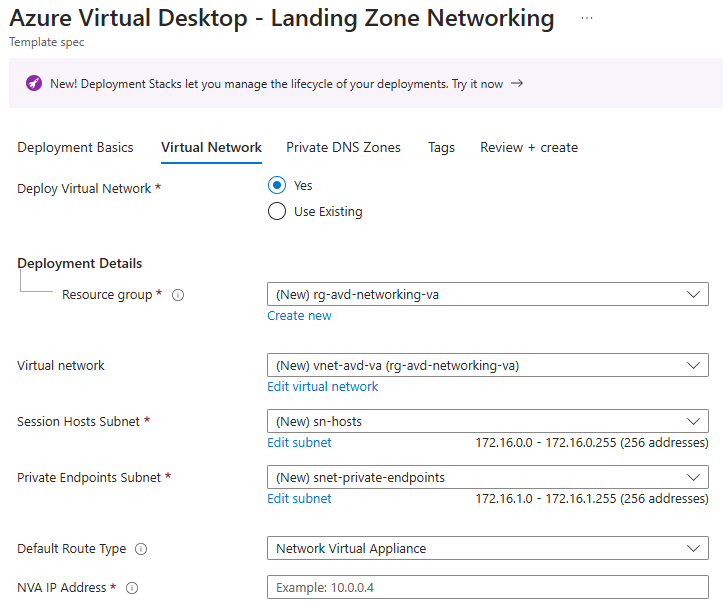
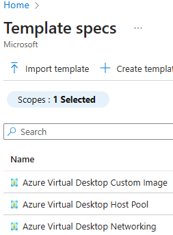
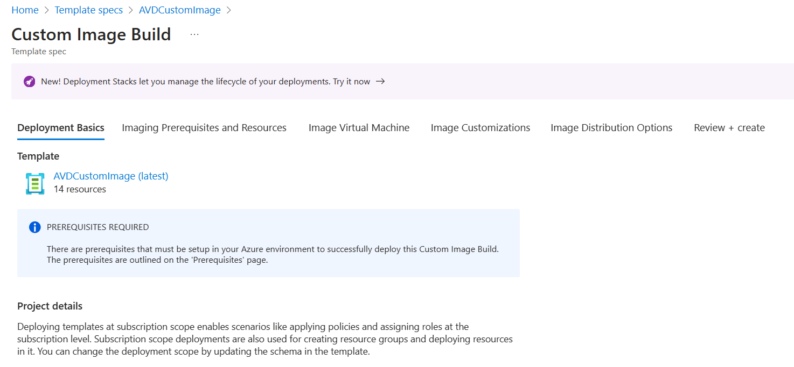
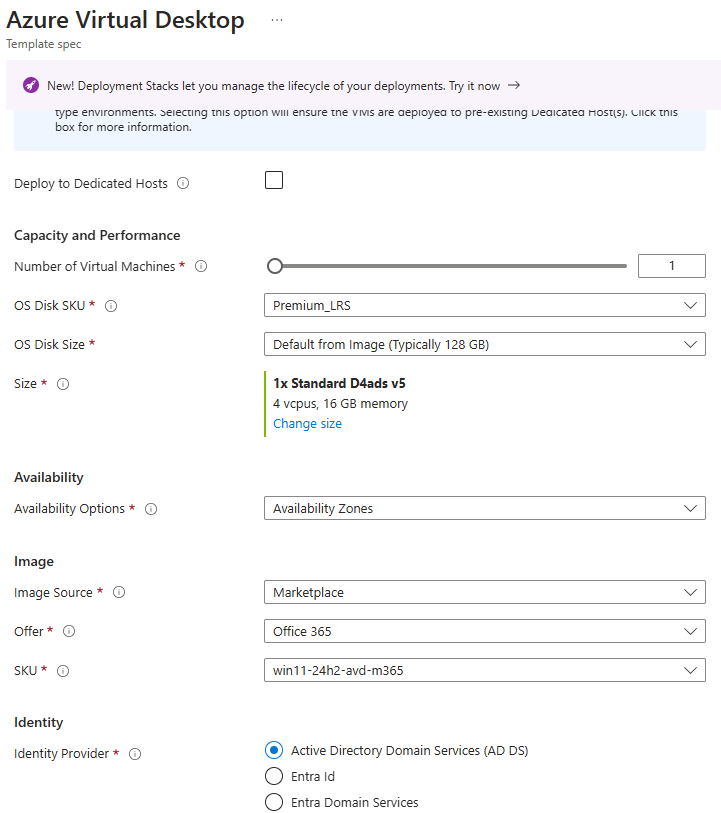
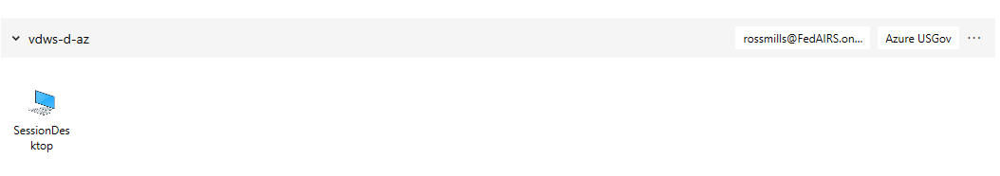

[**Home**](../README.md) | [**Design**](design.md) | [**Features**](features.md) | [**Limitations**](limitations.md) | [**Troubleshooting**](troubleshooting.md) | [**Parameters**](parameters.md) | [**Zero Trust Framework**](zeroTrustFramework.md)

# Quickstart Guide

## Overview

This solution consists of two main components:

1. Azure Virtual Desktop Host Pool Deployment - Complete Host Pool Deployment with associated resources such as Key Vaults, FSLogix storage accounts (or NetApp accounts), and monitoring resources.
2. Azure Virtual Desktop Custom Image Creation - Allows the creation of a custom image using automation in any cloud.

These two components are not dependent on one another (i.e., you can utilize one without the other or both together). They have some common prerequisites and some that are unique to each component. The barrier to entry is not high if you want to setup a simple PoC deployment, but to incorporate all the Zero-Trust capabilities, you'll need to complete the prerequisites within this guide.

There are three main methods for deploying the Azure Virtual Desktop (AVD) components:

1. Blue-Button Deployment from Github (not applicable to Air-Gapped Clouds)
2. Template Spec Deployment and GUI
3. Command Line Tools - AzCLI or PowerShell with Az Modules.

All methods require some initial setup in order for a successful deployment

## Prerequisites

There are several Azure resource prerequisites that are required to run this deployment. Read and complete the steps in this section to create the basic resources required for a successful pilot deployment. See [Microsoft Learn | Azure Virtual Desktop Prerequisites](https://learn.microsoft.com/en-us/azure/virtual-desktop/prerequisites) for the latest information.

### Required

- <details><summary><b>Licenses</b></summary>

  Ensure you have the [required licensing for AVD](https://learn.microsoft.com/en-us/azure/virtual-desktop/overview#requirements).
  </details>
- <details><summary><b>Networking</b></summary>
  
  Deployment requires a minimum of 1 Azure Virtual Network with one subnet to which the deployment virtual machine (deployment helper) and the session host(s) will be attached. For a PoC-type implementation of AVD with Entra ID authentication, this VNet can be standalone as there are no custom DNS requirements; however, for hybrid identity scenarios and Zero Trust implementations, the Virtual Network has DNS requirements as documented below under optional.
  
  Machines on this network need to be able to connect to the following network destinations:
  <ul>
  <li>Resource Manager Url TCP Port 443 (Commercial - management.azure.com, US Gov - management.usgovcloudapi.net). See <a href="imageAir-GappedCloud.md">Air-Gapped Cloud Image Management Details</a> for the Azure Secret and Azure Top Secret environment information. You can leverage the <a href="https://learn.microsoft.com/en-us/azure/azure-resource-manager/management/service-tags">AzureResourceManager service tag</a> in NSGs and the Azure Firewall to configure this access.
  </li>
  </ul>
  </details>
- <details><summary><b>Desktop Virtualization Resource Provider</b></summary>
  
  This feature is not enabled on subscriptions by default. Use the following link to enable the Microsoft.DesktopVirtualization resource provider in your subscription: [Enable the Feature](https://learn.microsoft.com/en-us/azure/virtual-desktop/prerequisites?tabs=portal)
  </details>
- <details><summary><b>Image Management Resources</b></summary>
  
  The deployment of the custom image build option depends on many artifacts that must be hosted in Azure Blob storage to satisfy Zero Trust principals or to build the custom image on Air-Gapped clouds. See [Air-Gapped Cloud Image Management Details](imageAir-GappedCloud.md) for more information. This repo contains the deploy-imagemanagement.ps1 helper script that should be used to deploy the image management resources and upload the artifacts to the created storage account.

  **Important:** Before running this script, see the Azure Permissions section below.

  </details>
- <details><summary><b>Azure Permissions</b></summary>
  <ul>
  <li><b>Required:</b> Ensure the principal deploying the solution has the "Owner" or ("Contributor" and "User Access Administrator") roles assigned on the target Azure subscription.<br>
  <b>Important:</b> Ensure that your role assignment does not have a condition that prevents you from assigning the 'Role-Based Access Control Administrator' role to other principals as the deployment assigns this role to the deployment user-assigned managed identity in order to allow it to automatically remove the role assignments that it creates during deployment.<br></li>  
  <li><b>Optional:</b> If you wish to use Azure Key Vaults to store and manage secrets, you'll want to ensure that the user principals managing Azure Virtual Desktop in your environment are granted the 'Key Vault Administrator' role to the subscription or at least the regional secrets key vaults and regional encryption key vaults (if customer managed keys are specified).</li>
  <li><b>Optional:</b> To utilize the image management resources for custom image builds or post deployment scripts, ensure that the user principals managing Azure Virtual Desktop in your environment are granted the 'Storage Blob Data Contributor' role to the subscription or at least the image management resource group.</li>
  <li><b>Optional:</b> Best practice, and in compliance with Microsoft's Secure Future Initiative, storage account keys should not be used for storage account access. Therefore, ensure that the user principals managing Azure Virtual Desktop in your environment are granted the 'Storage File Data Privileged Contributor' role to the subscription or at least the image management resource group.</li>
  </ul>
  </details>
- <details><summary><b>Security Group</b></summary>
  Create a security group for your AVD users. The type of group you must create depends on the Identity Solution:
  <ul>
  <li>Active Directory Domain Services: create the group in Active Directory and ensure the group has synchronized to Entra ID.</li>
  <li>Entra Domain Services: create the group in Entra ID or Active Directory and ensure the group has synchronized to Entra ID Domain Services.</li>
  <li>Entra Kerberos: create the group in Active Directory and ensure the group has synchronized to Entra ID.</li>
  <li>Entra ID: create the group in Entra ID.</li>
  </ul>
  </details>

### Optional

- <details><summary><b>Domain Services</b></summary>
  
  If you plan to utilize hybrid identities with either the Active Directory Domain Services or Entra Kerberos identity options, then ensure Active Directory Domain Services is configured and that you are synchronizing the required objects. AD Sites & Services should be configured for the address space of your Azure virtual network if you are extending your on-premises Active Directory infrastructure into the cloud.
  </details>
- <details><summary><b>DNS</b></summary>
  
  There are several DNS requirements:

  - If you plan to domain join the sessions hosts, you must configure your subnets to resolve the Domain SRV records for domain location services to function. This is normally accomplished by configuring custom DNS settings on your AVD session host Virtual Networks to point to the Domain Controllers or using a DNS resolver that can resolve the internal domain records.
  - In order to use private links and disable public access to storage accounts, key vaults, and other PaaS resources (in accordance with Zero Trust Guidance), you must ensure that the following private DNS zones are also resolvable from the session host Virtual Networks:

    | Purpose | Commercial Name | USGov Name | 
    | ------- | --------------- | ---------- | 
    | **AVD PrivateLink Global Feed** | privatelink-global.wvd.microsoft.com | privatelink-global.wvd.usgovcloudapi.net |
    | **AVD PrivateLink Workspace Feed and Hostpool Connections** | privatelink.wvd.microsoft.com | privatelink.wvd.usgovcloudapi.net |
    | **Azure Backup** | privatelink.`<geo>`.backup.windowsazure.com[^1] | privatelink.`<geo>`.backup.windowsazure.us[^1] |
    | **Azure Blob Storage**<br>- image management artifacts<br>- backup<br>- managed disk access | privatelink.blob.core.windows.net | privatelink.blob.core.usgovcloudapi.net |
    | **Azure Files**<br>- FSLogix Storage | privatelink.file.core.windows.net | privatelink.file.core.usgovcloudapi.net |
    | **Azure Key Vault**<br>-vm secrets<br>- customer managed keys | privatelink.vaultcore.azure.net | privatelink.vaultcore.usgovcloudapi.net |
    | **Azure Queue Storage**<br>- storage quota function app | privatelink.queue.core.windows.net | privatelink.queue.core.usgovcloudapi.net |
    | **Azure Table Storage**<br>- storage quota function app | privatelink.table.core.windows.net | privatelink.table.core.usgovcloudapi.net |
    | **Azure Web Sites**<br>- storage quota function app | privatelink.azurewebsites.net | privatelink.azurewebsites.us |

  > [!NOTE]
  > - For Private DNS values on Azure Secret, see [Azure Government Secret Private DNS Zone Values](https://review.learn.microsoft.com/en-us/microsoft-government-secret/azure/azure-government-secret/services/networking/private-link/private-endpoint-dns?branch=main)
  > - For Private DNS zone values on Azure Top Secret, see [Azure Government Top Secret Private DNS Zone Values](https://review.learn.microsoft.com/en-us/microsoft-government-topsecret/azure/azure-government-top-secret/services/networking/private-link/private-endpoint-dns?branch=main)
  </details>
- <details><summary><b>Domain Permissions</b></summary>
  <ul>
    <li> For <b>Active Directory Domain Services</b>, create a principal to domain join the session hosts and Azure Files, using the following steps:
        <ol>
            <li>Open <b>Active Directory Users and Computers</b>.</li>
            <li>Navigate to your service accounts Organizational Unit (OU).</li>
            <li>Right-click on the OU and select <b>New > User</b>.</li>
            <li>Type the appropriate values into the dialog box. Recommend that you set a strong password and set the <i>Password never expires</i> option. Complete the creation of the <i>service</i> account.</li>
            <li>In the <b>Active Directory Users and Computers</b> mmc, select <b>View > Advanced Features</b> from the menu bar.</li>
            <li>Create an OU for the AVD computers if not already present.</li>
            <li>Right-click on the AVD computer OU and select <b>Properties</b>.</li>
            <li>Select the <b>Security</b> tab.</li>
            <li>Click the <b>Advanced</b> button.</li>
            <li>In the <b>Advanced Security Settings for <i>OU Name</i></b> window, click the <b>Add</b> button.</li>
            <li>Select a principal by clicking on the <b>Select a principal</b> link. Search for the newly created <i>service</i> account, click on <b>Check Names</b>, and then click <b>OK</b>.
            <li>In the <b>Permission Entry for <i>OU Name</i></b> window, ensure that the "Applies to:" drop down is set to "This object and all descendant objects" and then under Permissions, select only "Create Computer Objects" and "Delete Computer Objects". Select <b>OK</b> to save the entry.</li>
            <li>Back in the <b>Advanced Security Settings for <i>OU Name</i></b> window, click the <b>Add</b> button.</li>
            <li>Select a principal by clicking on the <b>Select a principal</b> link. Search for the newly created <i>service</i> account, click on <b>Check Names</b>, and then click <b>OK</b>.
            <li>In the <b>Permission Entry for <i>OU Name</i></b> window, ensure that the "Applies to:" drop down is set to "Descendant Computer objects" and then under Permissions, select only "Read all properties", "Write all properties", "Read permissions", "Modify permissions", "Change password", "Reset password", "Validated write to DNS host name", and "Validated write to service principal name". Select <b>OK</b> to save the entry.</li>
            <li>Select <b>OK</b> until you are returned to the <b>Active Directory Users and Computers</b> window.</li>
        </ol>
        <li>For <b>Entra ID Domain Services</b>, ensure the principal is a member of the "AAD DC Administrators" group in Azure AD.</li>
        </ul>
  </details>
- <details><summary><b>FSLogix with Azure NetApp Files</b></summary>
  
  The following steps must be completed if you plan to use this service.
  <ul>
    <li><a href="https://learn.microsoft.com/azure/azure-netapp-files/azure-netapp-files-register">Register the resource provider</a></li>
    <li><a href="https://learn.microsoft.com/azure/azure-netapp-files/create-active-directory-connections#shared_ad">Enable the shared AD feature</a> - this feature is required if you plan to deploy more than one domain joined NetApp account in the same Azure subscription and region.</li>
  </ul>
  </details>
- <details><summary><b>AVD Private Link</b></summary>
  
    This feature is not enabled on subscriptions by default. Use the following link to enable AVD Private Link on your subscription: [Enable the Feature](https://learn.microsoft.com/azure/virtual-desktop/private-link-setup)
  </details>
- <details><summary><b>Marketplace Image:</b></summary>
  
  If you plan to deploy this solution using PowerShell or AzureCLI and use a marketplace image for the virtual machines, use the code below to find the appropriate image (the Template Spec and Blue Button deployment UIs also automatically populate the available options.).

  ```powershell
  # Determine the Publisher; input the location for your AVD deployment
  $Location = '<location>'
  (Get-AzVMImagePublisher -Location $Location).PublisherName

  # Determine the Offer; common publisher is 'MicrosoftWindowsDesktop' for Win 10/11
  $Publisher = 'MicrosoftWindowsDesktop'
  (Get-AzVMImageOffer -Location $Location -PublisherName $Publisher).Offer

  # Determine the SKU; common offers are 'Windows-10' for Win 10 and 'office-365' for the Win10/11 multi-session with M365 apps
  $Offer = ''
  (Get-AzVMImageSku -Location $Location -PublisherName $Publisher -Offer $Offer).Skus

  # Determine the Image Version; common offers are '21h1-evd-o365pp' and 'win11-21h2-avd-m365'
  $Sku = ''
  Get-AzVMImage -Location $Location -PublisherName $Publisher -Offer $Offer -Skus $Sku | Select-Object * | Format-List
  ```
  </details>
- <details><summary><b>Encryption At Host</b></summary>
  
    The "encryption at host" feature should be deployed on the virtual machines to meet Zero Trust compliance. This feature is not enabled in your Azure subscription by default and must be manually enabled. Use the following steps to enable the feature: [Enable Encryption at Host](https://learn.microsoft.com/azure/virtual-machines/disks-enable-host-based-encryption-portal).
    </details>
- <details><summary><b>Confidential VM Disk Encryption with Customer Managed Keys</b></summary>

    In order to deploy Virtual Machines with Confidential VM encryption and customer managed keys, you will need to create the 'Confidential VM Orchestrator' application in your tenant. Use the following steps to complete this prerequisite.

    <ol>
    <li>Open PowerShell (preferably PowerShell 7 or later), and install the latest Az Modules.

    If you launched PowerShell (or pwsh) as an administrator, use the following command:
    ``` powershell
    Install-Module -Name Microsoft.Graph -AllowClobber -Force
    ```

    If you did not launch pwsh as an administrator, use the following command:

    ``` powershell
    Install-Module -Name Microsoft.Graph -AllowClobber -Force -Scope CurrentUser
    ```
    </li>
    <li>From the same PowerShell (or pwsh) console, execute the following PowerShell commands replacing "your tenant ID" with the correct value.

    ``` powershell
    Connect-Graph -Tenant "your tenant ID" Application.ReadWrite.All
    New-MgServicePrincipal -AppId bf7b6499-ff71-4aa2-97a4-f372087be7f0 -DisplayName "Confidential VM Orchestrator"
    ```
    </li>
    </ol>

    You will then need to specify the objectId property of this new service principal in the 'confidentialVMOrchestratorObjectId' parameter for the AVD Host Pool Deployment. The parameters for this deployment are documented at [AVD Host Pool Parameters](parameters.md#avd-host-pool-deployment-parameters).
  </details>

### Tools

#### PowerShell Az Module Installation

In order to run the scripts that simplify setup and complete the prerequisites you will need the 'Az' PowerShell module.

You can install PowerShell modules for all users or for the current user. In order to install modules for all users, you must launch PowerShell as an administrator.

Open PowerShell (preferably PowerShell 7 or later), and install the latest Az Modules.

If you launched PowerShell (or pwsh) as an administrator, use the following command:

``` powershell
Install-Module -Name Az -AllowClobber -Force
```

If you did not launch pwsh as an administrator, use the following command:

``` powershell
Install-Module -Name Az -AllowClobber -Force -Scope CurrentUser
```

Additional Information can be found at [Install Azure Powershell](https://learn.microsoft.com/en-us/powershell/azure/install-azure-powershell).

#### Bicep Installation

You *should* install Bicep to complete the deployments as all templates are more easily maintained as Bicep and need to be transpiled to ARM templates during deployment or Template Spec creation when not referencing the transpiled json.

Launch a PowerShell window and enter the following commands:

``` powershell
## Create the install folder
$installPath = "$env:USERPROFILE\.bicep"
$installDir = New-Item -ItemType Directory -Path $installPath -Force
$installDir.Attributes += 'Hidden'
## Fetch the latest Bicep CLI binary
(New-Object Net.WebClient).DownloadFile("https://github.com/Azure/bicep/releases/latest/download/bicep-win-x64.exe", "$installPath\bicep.exe")
## Add bicep to your PATH
$currentPath = (Get-Item -path "HKCU:\Environment" ).GetValue('Path', '', 'DoNotExpandEnvironmentNames')
if (-not $currentPath.Contains("%USERPROFILE%\.bicep")) { setx PATH ($currentPath + ";%USERPROFILE%\.bicep") }
if (-not $env:path.Contains($installPath)) { $env:path += ";$installPath" }
## Verify you can now access the 'bicep' command.
bicep --help
```

Additional Information can be found [Install Bicep](https://learn.microsoft.com/en-us/azure/azure-resource-manager/bicep/install).

### Authentication to Azure

1. Connect to the correct Azure environment where `<Environment>` equals "AzureCloud", "AzureUSGovernment", or the air-gapped equivalents.

   ``` powershell
   Connect-AzAccount -Environment <Environment>
   ```

2. Ensure that your context is configured with the subscription where you want to deploy the image management resources.

   ``` powershell
   Set-AzContext -Subscription <subscriptionID>
   ```

### Template Spec Creation

A template spec is a resource type for storing an Azure Resource Manager template (ARM template) in Azure for later deployment. This resource type enables you to share ARM templates with other users in your organization. Just like any other Azure resource, you can use Azure role-based access control (Azure RBAC) to share the template spec.

Template specs provide the following benefits:

- You use standard ARM templates for your template spec.
- You manage access through Azure RBAC, rather than SAS tokens.
- Users can deploy the template spec without having write access to the template.
- You can integrate the template spec into existing deployment process, such as PowerShell script or DevOps pipeline.
- You can generate custom portal forms for ease of use and understanding.

For more information see [Template-Specs | Microsoft Learn](https://learn.microsoft.com/en-us/azure/azure-resource-manager/templates/template-specs?tabs=azure-powershell) and [Portal Forms for Template Specs](https://learn.microsoft.com/en-us/azure/azure-resource-manager/templates/template-specs-create-portal-forms).

The AVD deployments created in this repo come with the custom portal forms for each template. The easiest way to create the Template Specs from the templates in this repo is to utilize the **New-TemplateSpecs.ps1** file located in the **deployments** folder. Follow these instructions to execute this script.

1. Connect to the correct Azure environment where `<Environment>` equals 'AzureCloud', 'AzureUSGovernment', or the air-gapped equivalent.

   ``` powershell
   Connect-AzAccount -Environment <Environment>
   ```

2. Ensure that your context is configured with the subscription where you want to deploy the image management resources. Replace `<subscriptionID>` with the actual subscription ID.

   ``` powershell
   Set-AzContext -Subscription <subscriptionID>
   ```

3. Change your directory to the **deployments** folder and execute the following command, replacing the `<location>` placeholder with a valid region name.

   ``` powershell
   .\New-TemplateSpecs.ps1 -Location <location>
   ```

### Networking

In order to deploy the image management storage account with private endpoints, create a custom image, and deploy session hosts (virtual machines), you must have an existing Virtual Network with at least one subnet. Ideally, you have already created an Azure Landing Zone including a hub network and private DNS zones (as required).

In order to deploy the Azure Virtual Desktop standalone or spoke network and required private DNS Zones, you can utilize the **Azure Virtual Desktop Networking** template spec with portal ui or blue button deployment directly. This template spec deployment will automate the creation of the spoke virtual network, required subnets, peering (if needed), route tables (if needed), NAT gateway (if needed), and missing private DNS zones (if needed).

#### Option 1: Blue-Button Deployment via the Azure Portal

> [!IMPORTANT]
> For Air-Gapped Networks, you must use a template spec.

1. Click on the appropriate button below.

    [](https://portal.azure.com/#blade/Microsoft_Azure_CreateUIDef/CustomDeploymentBlade/uri/https%3A%2F%2Fraw.githubusercontent.com%2FAzure%2FFederalAVD%2Fmaster%2F%2Fdeployments%2Fnetworking%2Fnetworking.json/uiFormDefinitionUri/https%3A%2F%2Fraw.githubusercontent.com%2FAzure%2FFederalAVD%2Fmaster%2F%2Fdeployments%2Fnetworking%2FuiFormDefinition.json) [](https://portal.azure.us/#blade/Microsoft_Azure_CreateUIDef/CustomDeploymentBlade/uri/https%3A%2F%2Fraw.githubusercontent.com%2FAzure%2FFederalAVD%2Fmaster%2F%2Fdeployments%2Fnetworking%2Fnetworking.json/uiFormDefinitionUri/https%3A%2F%2Fraw.githubusercontent.com%2FAzure%2FFederalAVD%2Fmaster%2F%2Fdeployments%2Fnetworking%2FuiFormDefinition.json)

2. Populate the form with correct values. Use the the tool tips for more detailed parameter information.

    

3. Once all values are populated, deploy the template. Parameter values and the template can be downloaded from the deployment view.

   Save the resource id of the subnet for use in the parameters files below as follows:

   1. imageManagement - `privateEndpointSubnetResourceId`
   2. imageBuild = `privateEndpointSubnetResourceId`
   3. hostpools = `managementAndStoragePrivateEndpointSubnetResourceId`

#### Option 2: Using a Template Spec and Portal Form

1. Go to Template Specs in the Azure Portal.

    

2. Choose the **Azure Virtual Desktop Networking** Template Spec and click "Deploy"

    

3. Populate the form with correct values. Use the the tool tips for more detailed parameter information.

    

4. Once all values are populated, deploy the template. Parameter values and the template can be downloaded from the deployment view.

   Save the resource id of the subnet for use in the parameters files below as follows:

   1. imageManagement - `privateEndpointSubnetResourceId`
   2. imageBuild = `privateEndpointSubnetResourceId`
   3. hostpools = `managementAndStoragePrivateEndpointSubnetResourceId`

While utilizing private endpoints is optional, it must be deployed in order to follow Zero Trust principles. Both the image management and AVD deployments can use private endpoints for the following:

- Image Management - Blob Storage Account
- Image Build - Blob Storage Account for logging customizations
- AVD Deployment - Azure Files for FSLogix profiles, Azure Key Vault for storing secrets and Customer Managed Keys, AVD Private Link, Azure Recovery Services, and the Function App deployed to increase premium storage account quotas.

## Deployment

### Deploy Image Management Resources

If you plan to build custom images or add custom software or run scripts during the deployment of your session hosts, you should deploy the image management resources to support Zero Trust. You can also choose not to deploy these resources, but the image build VM will need access to the Internet to download the source files required for installation/configuration.

The [deployments/Deploy-ImageManagement.ps1](../deployments/Deploy-ImageManagement.ps1) script is the easiest way to ensure all necessary image management resources (scripts and installers and Compute Gallery for custom image option.) are present for the AVD deployment.

> [!NOTE]
> For Zero Trust deployments, see [Image Management Parameters](parameters.md#avd-image-management-parameters) for an explanation of all the parameters.

1. Create a custom imageManagement parameter file for your environment by copying [deployments/imageManagement/parameters/imageManagement.parameters.json](../deployments/imageManagement/parameters/imageManagement.parameters.json) to a new file and naming it with a custom prefix, hereafter referred to as `<customprefix>`.

1. Create a custom downloads parameters file by copying the appropriate downloads.parameters.json file from the [deployments/imageManagement/parameters](../deployments/imageManagement/parameters) for the cloud you are in (i.e. public.downloads.parameters.json for AzureCloud (commercial/IL2) and AzureUSGovernment (IL4/5), secret for Azure Secret, and topsecret for Azure Top Secret) to a new file with the same custom prefix.

1. Set required parameters and make any optional updates desired in the two new files.

   - deployments/imageManagement/parameters/`<customprefix>`.imageManagement.parameters.json
   - deployments/imageManagement/parameters/`<customprefix>`.downloads.parameters.json
  
1. **[Optional]** If you wish to add any custom scripts or installers beyond what is already included in the artifacts directory [.common/artifacts](../.common/artifacts), then gather your installers and create a new folder inside the artifacts directory for each customizer or application. In the folder create or place one and only one PowerShell script (.ps1) that installs the application or performs the desired customization. For an example of the installation script and supporting files, see the [.common/artifacts/VSCode](../.common/artifacts/VSCode) folder. These customizations can be applied to the custom image via the `customizations` deployment parameter.

1. **[Optional]** The `SkipDownloadingNewSources` switch parameter will disable the downloading of the latest installers (or other files) from the Internet (or other network). Do not use this switch if you want to enable an "evergreen" capability that helps you keep your images and session hosts up to date. In addition, update the Urls specified in the `<customprefix>.downloads.parameters.json`[^2] file in the [deployments/imageManagement/parameters](../deployments/imageManagement/parameters) folder to match your network environment. You can also not depend on this automated capability and add source files directly to the appropriate location in the [.common/artifacts](../.common/artifacts/) folder. This directory is processed by zipping the contents of each child directory into a zip file and then all existing files in the root plus the zip files are added to the blob storage container in the Storage Account.

1. Open the PowerShell version where you installed the Az module above. If not already connected to your Azure environment, then connect to the correct Azure environment where `<Environment>` equals "AzureCloud", "AzureUSGovernment", or the air-gapped equivalent.

    ``` powershell
    Connect-AzAccount -Environment <Environment>
    ```

1. Ensure that your context is configured with the subscription to where you want to deploy the image management resources.

    ``` powershell
    Set-AzContext -Subscription <subscriptionID>
    ```

1. Change directories to the [deployments](../deployments) folder and execute the [Deploy-ImageManagement.ps1](../deployments/Deploy-ImageManagement.ps1) script as follows:

    ``` powershell
    .\Deploy-ImageManagement.ps1 -DeployImageManagementResources -Location <Region> -ParameterFilePrefix <customprefix> [-SkipDownloadingNewSources] [-TempDir <Temp directory for artifacts>] [-DeleteExistingBlobs] [-TeamsTenantType <TeamsTenantType>]
    ```

> [!IMPORTANT]
> For Air-Gapped cloud instructions, see [Custom Image Air-Gapped Cloud Considerations](imageAir-GappedCloud.md) for more detailed instructions.

<details><summary><b>Script Details</b></summary>
<ol>
    <li>With the '-DeployImageManagementResources' switch, deploys the resources in the [deployments/imageManagement/imageManagement.bicep](../deployments/imageManagement/imageManagement.bicep) to create the following Azure resources in the Image Management resource group:
        <ul>
            <li><a href="https://learn.microsoft.com/en-us/azure/virtual-machines/azure-compute-gallery">Compute Gallery</a></li>
            <li><a href="https://learn.microsoft.com/en-us/azure/storage/common/storage-account-overview">Storage Account</a></li>
            <li><a href="https://learn.microsoft.com/en-us/azure/storage/blobs/blob-containers-portal">Storage Account Blob Container</a></li>
            <li><b>Optional</b> <a href="https://learn.microsoft.com/en-us/azure/storage/blobs/monitor-blob-storage?tabs=azure-portal">Storage Account Diagnostic Setting to LogAnalytics</a></li>
            <li><a href="https://learn.microsoft.com/en-us/entra/identity/managed-identities-azure-resources/overview">User Assigned Managed Identity</a></li>
            <li><a href="https://learn.microsoft.com/en-US/Azure/role-based-access-control/role-assignments">Necessary role assignments</a></li>
            <li><b>Optional</b> <a href="https://learn.microsoft.com/en-us/azure/private-link/private-endpoint-overview"></a></li>
        </ul>
    </li>
    <li>If the '-SkipDownloadingNewSources' switch is <u>not</u> set, downloads new source files into a temporary directory, generates a text file containing file versioning information, and then copies those directories/files to the Artifacts directory overwriting any existing files.</li>
    <li>Compresses the contents of each subfolder in the Artifacts directory into a zip file into a second temporary directory. Copies any files in the root of the Artifacts directory into the same temporary directory.</li>
    <li>Uploads the contents of the temporary directory as individual blobs to the storage account blob container overwriting any existing blobs with the same name.</li>
</details>

### Create a Custom Image (optional)

A custom image may be required or desired by customers in order to pre-populate VMs with applications and settings.

This deployment can be done via Command Line, Blue Button, or through a Template Spec UI in the Portal.

#### Option 1: Blue-Button Deployment via the Azure Portal

> [!IMPORTANT]
> For Air-Gapped Networks, you must use a template spec.

This option opens the deployment UI for the solution in the Azure Portal. Be sure to select the button for the correct cloud. If your desired cloud is not listed, please use the template spec detailed in the Quick Start guide.

[](https://portal.azure.com/#blade/Microsoft_Azure_CreateUIDef/CustomDeploymentBlade/uri/https%3A%2F%2Fraw.githubusercontent.com%2FAzure%2FFederalAVD%2Fmaster%2F%2Fdeployments%2FimageManagement%2FimageBuild%2FimageBuild.json/uiFormDefinitionUri/https%3A%2F%2Fraw.githubusercontent.com%2FAzure%2FFederalAVD%2Fmaster%2F%2Fdeployments%2FimageManagement%2FimageBuild%2FuiFormDefinition.json) [](https://portal.azure.us/#blade/Microsoft_Azure_CreateUIDef/CustomDeploymentBlade/uri/https%3A%2F%2Fraw.githubusercontent.com%2FAzure%2FFederalAVD%2Fmaster%2F%2Fdeployments%2FimageManagement%2FimageBuild%2FimageBuild.json/uiFormDefinitionUri/https%3A%2F%2Fraw.githubusercontent.com%2FAzure%2FFederalAVD%2Fmaster%2F%2Fdeployments%2FimageManagement%2FimageBuild%2FuiFormDefinition.json)

#### Option 2: Using a Template Spec and Portal Form

1. Go to Template Specs in the Azure Portal.

    

1. Choose the **Azure Virtual Desktop Custom Image** Template Spec and click "Deploy"

    

1. Populate the form with correct values. Use the the tool tips for more detailed parameter information.

    

1. Once all values are populated, deploy the template. Parameter values and the template can be downloaded from the deployment view

#### Option 3: Using Command Line

1. Create a new parameters file using imageBuild.parameters.json as a reference and by referencing the [Image Build Parameters Reference](parameters.md#avd-image-build-parameters).

1. Deploy the Image Build

    ``` powershell
    $Location = '<Region>'
    $DeploymentName = '<valid deployment name>'
    New-AzDeployment -Location $Location -Name $DeploymentName -TemplateFile '.\deployments\imageManagement\imageBuild\imageBuild.json' -TemplateParameterFile '.\deployments\imageManagement\imageBuild\parameters\`<customprefix>`.imageBuild.parameters.json' -Verbose
    ```

### Deploy an AVD Host Pool

The AVD solution includes all necessary resources to deploy a usable virtual desktop experience within Azure. This includes a host pool, application group, virtual machine(s) as well as other auxilary resources such as monitoring and profile management.

#### Option 1: Blue-Button Deployment via the Azure Portal

> [!IMPORTANT]
> For Air-Gapped Networks, you must use a template spec.

This option opens the deployment UI for the solution in the Azure Portal. Be sure to select the button for the correct cloud. If your desired cloud is not listed, please use the template spec detailed in the Quick Start guide.

[](https://portal.azure.com/#blade/Microsoft_Azure_CreateUIDef/CustomDeploymentBlade/uri/https%3A%2F%2Fraw.githubusercontent.com%2FAzure%2FFederalAVD%2Fmaster%2F%2Fdeployments%2Fhostpools%2Fhostpool.json/uiFormDefinitionUri/https%3A%2F%2Fraw.githubusercontent.com%2FAzure%2FFederalAVD%2Fmaster%2F%2Fdeployments%2Fhostpools%2FuiFormDefinition.json) [](https://portal.azure.us/#blade/Microsoft_Azure_CreateUIDef/CustomDeploymentBlade/uri/https%3A%2F%2Fraw.githubusercontent.com%2FAzure%2FFederalAVD%2Fmaster%2F%2Fdeployments%2Fhostpools%2Fhostpool.json/uiFormDefinitionUri/https%3A%2F%2Fraw.githubusercontent.com%2FAzure%2FFederalAVD%2Fmaster%2F%2Fdeployments%2Fhostpools%2FuiFormDefinition.json)

#### Option 2: Using a Template Spec and Portal Form

1. Go to Template Specs in the Azure Portal

    

1. Choose the **Azure Virtual Desktop HostPool** Template Spec click "Deploy"

    

1. Populate the form with correct values. Use the table above or the tool tips for more detailed parameter information.

    

1. Once all values are populated, deploy the template. Parameter values and the template can be downloaded from the deployment view

#### Option 3: Using Command Line

1. Create a parameters file [`<identifier>`-`<index>`.parameters.json] based on [deployments/hostpools/parameters/solution.parameters.json](../deployments/hostpools/parameters/hostpool.parameters.json) by reviewing the documentation at [AVD Host Pool Parameters](parameters.md#avd-host-pool-deployment-parameters).

1. Deploy the AVD Host Pool (and supporting resources)

    ``` powershell
    $Location = '<Region>'
    $DeploymentName = '<valid deployment name>'
    New-AzDeployment -Location $Location -Name $DeploymentName -TemplateFile '.\deployments\hostpools\hostpool.bicep' -TemplateParameterFile '.\deployments\hostpools\parameters\hostpoolid.parameters.json' -Verbose
    ```

## Validation

Once all resources have been deployed, the Virtual Machine should be accessible using [Windows Remote Desktop](https://learn.microsoft.com/en-us/azure/virtual-desktop/users/connect-windows?pivots=remote-desktop-msi) or through [AVD Web](https://aka.ms/avdweb) for Azure Commercial and [AVD Gov Web](https://aka.ms/avdgov) for Azure US Government.

The VM should appear and allow you to log in. Authentication depends on the identity solution supplied in the AVD Deployment step.



[^1]: To determine the value of `<geo>`, see the [locations](../.common/data/locations.json) file in this repo. The recoveryServicesGeo property of each location from each cloud is listed.

[^2]: The value of `<environment>` is 'public' for the Azure Cloud and Azure US Government environments. The value of `<environment>` is 'secret' for the Azure US Secret air-gapped cloud and 'topsecret' for the Azure Government Top Secret air-gapped cloud.
