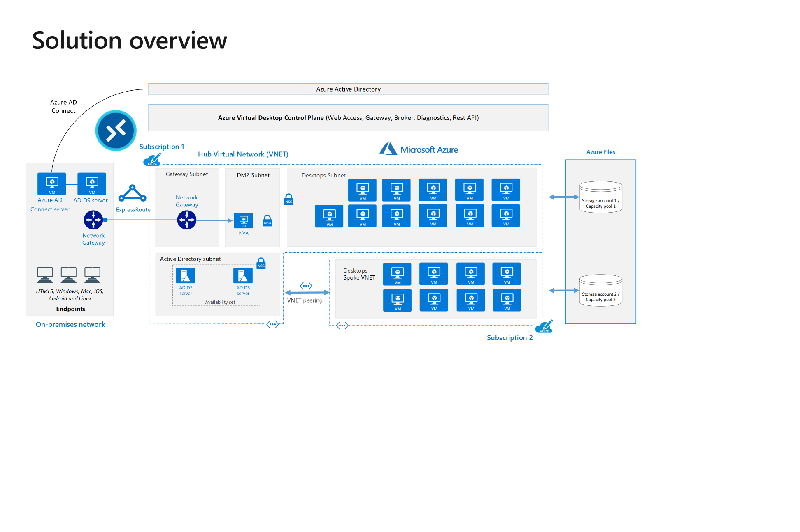
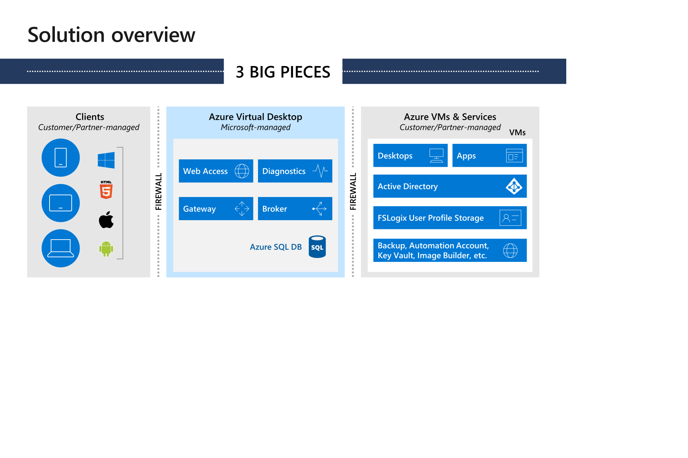
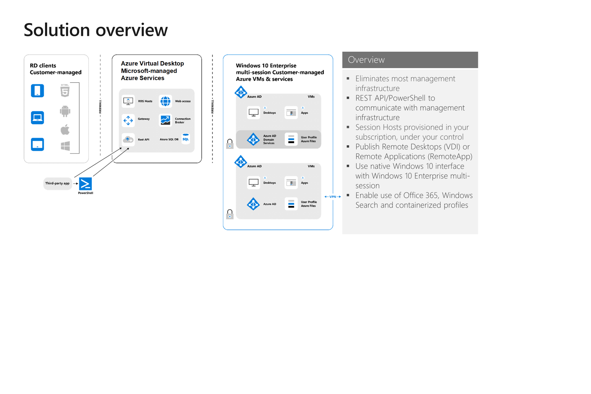
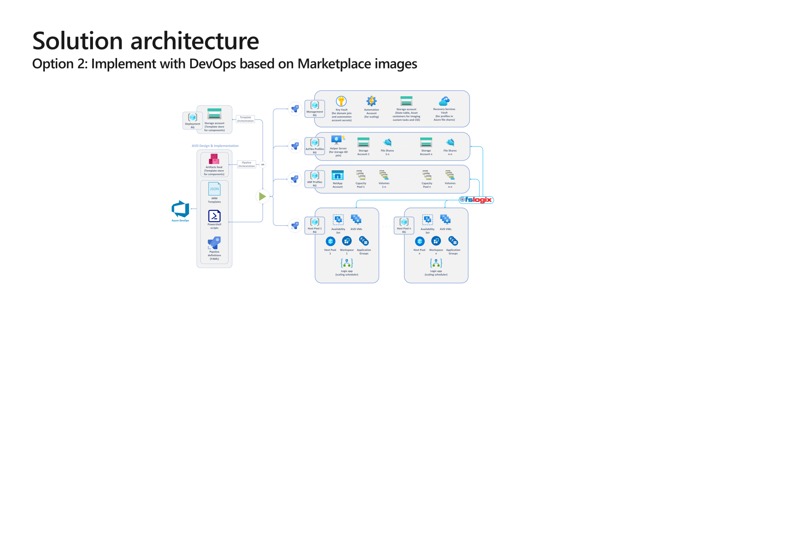

[**Home**](../README.md) | [**Design**](design.md) | [**Features**](features.md) | [**Get Started**](quickStart.md) | [**Troubleshooting**](troubleshooting.md) | [**Parameters**](parameters.md) | [**Zero Trust Framework**](zeroTrustFramework.md)

# Scope

## Solution

The Azure Virtual Desktop (AVD) solution offering will deploy fully operational AVD Hostpool(s) to an Azure Subscription.  

This solution incorporates the 3 areas of client, Azure Virtual Desktop control plane, and Azure VMs as shown below:

The offering takes into account the elimination of most management infrastructure, session hosts provisioned into your subscriptions as needed, using native Windows 11 interface and enablement of Office 365.  

## Solution Outcomes

### Option 1

Description: Implement with DevOps with lifecycle management based on custom images.

Outcomes:

1. Deployment of an Azure Virtual Desktop (AVD) solution with Azure DevOps automation that includes:
   - Provision of up to 2 AVD host pools with up to 4 session host VMs each based on custom images.
   - Create up to 6 AVD app groups and assistance.
   - Publish up to 6 RemoteApp applications or remote desktops.
1. Generate 1 custom image from code, using:
   - Azure DevOps pipelines and PowerShell scripts.
   - Azure Image Builder, Azure Shared Image Gallery.
   - Host pool lifecycle management based on custom images.
1. Enablement of FSLogix Office and Proflie containers which includes:
   - Configuration of Azure Files to store profile containers.
   - Option to backup file shares to Recovery Services Vault (SRV).
1. Host Pool Scaling Plans.
1. Configuration of Diagnostics logs from Azure Virtual Desktlop to Azure Log Analytics.

#### Option 2

Description: Implement with DevOps based on Marketplace images.

Outcomes:

1. Deployment of an Azure Virtual Desktop (AVD) solution with Azure DevOps automation that includes:
   1. Provision up to 2 AVD host pools with up to 4 session host VMs each, based on Azure marketplace images.
2. Create up to 6 AVD app groups and assistance.
   1. Publish up to 6 RemoteApp applications or remote desktops.
3. Enablement of FSLogix Office and Profile Containers which includes:
   - Configuration of Azure Files to store the profile containers.
   - Option to backup file shares to Recovery Services Vault (RSV).
4. Host Pool Scaling Plans.
5. Configuration of Diagnostics logs from Azure Virtual Desktlop to Azure Log Analytics.

## Decision areas

### Azure DevOps Automation

- [ ] Do you already use Azure DevOps? Are you comfortable with using and modifying BICEP files, PowerShell scripts, and YAML pipelines?

If you already use Azure DevOps, we recommend the Azure Virtual Desktop Design and Implementation component to facilitate rapid deployment and/or code-based lifecycle management.
Using the automation solution has significant benefits over manual deployment: it makes the process reliably repeatable and scalable.

The true potential of this solution can only be unlocked if your teams are familiar with the tools used in the solution, such as: BICEP files, PowerShell scripts, and YAML pipelines – thus, the DevOps Automation solution can be leveraged beyond the initial deployment of the AVD environment in scope.

If the answer to the above question is yes, this AVD Design and Implementation solution is strongly recommended.

If the answer is no, ISD can only assist you with building an automated solution based on BICEP templates and PowerShell scripts, leveraging your choice of pipeline solution.

### Azure Subscription and Domain Controller connectivity

- [ ] Do you have an existing Azure subscription with connectivity to Domain Controllers?

Implementing Azure Virtual Desktop requires an Azure subscription and access to Active Directory Domain Services. An existing domain is typically used but we can also use Entra ID Domain Services. Note, that Entra ID Domain Services has certain limitations, e.g. using custom GPO ADMX templates is not supported; you have to sync password hashes to Entra ID to leverage Entra ID Domain Services for AVD.

Session Hosts MUST be domain joined and cannot be simply managed using Intune or competing products. Domain Services may be available in various ways:

- Azure VNETs have access to domain controllers hosted in Azure (same or other VNET).
- Azure VNETs have access to domain controllers on-premises through ExpressRoute or S2S VPN.
- Customer implemented Entra ID Domain Services.

Entra ID Domain Services
This approach has limitations but doesn’t require you to manage Domain Controllers in the cloud.

Active Directory Domain Services
This approach provides you all capabilities of Active Directory, but you need to set up and manage Domain Controllers in Azure.

### Azure Regions

- [ ] Do you wish to deploy AVD in a single Azure region?

When deploying to a single Azure region, we can simply leverage a set of cloud file shares (Azure Files) and have the best experience when using Azure AD Domain Services (Azure ADDS) or on-premises Active Directory Domain Services (ADDS).

In case of a multi-region deployment, users’ profiles must be as close to the AVD VMs they log in to, as possible. This requires a more complex design, including networking requirements, Azure Files service deployed in multiple regions, or leveraging a multi-region or replication capable file service (not covered in this solution).

### Custom Images

- [ ] In the cloud, would you leverage custom images to package applications and/or optimized OS/App configuration to facilitate rapid deployment?

The default Azure Virtual Desktop deployment uses Azure Marketplace images (any supported Windows Server or Windows client OS). However, we can customize the deployment to use your own images and help manage your images using Azure Image Builder (or the Zero Trust Compliant image build solution provided in this repo) and Shared Image Galleries.

Using custom images to deliver Azure Virtual Desktop can speed up the resource deployment process, as (majority of) the application components are not installed on the VMs at deployment time.

If you plan to leverage cloud native technologies, such as Azure DevOps pipelines, PowerShell scripts, Azure Image builder, and Azure Shared Image Gallery to programmatically generate images , we recommend you “Option 1: Implement with DevOps with lifecycle management based on custom images” within this AVD Design and Implementation solution.

If you don’t prefer to leverage custom images, and you accept the added time that it takes to programmatically install application on your AVD VMs at deployment time, you would like to manually install applications on your AVD VMs, we recommend “Option 2: Implement with DevOps based on Marketplace images” within this AVD Design and Implementation solution.

NOTE: Microsoft can only assist with customizing images based on Azure native technologies. Image customization activities will be time-boxed.

### Custom Image as Code

- [ ] Would you like to leverage Azure DevOps and the custom image creation deployment capability to programmatically generate custom images, or do you already have an existing imaging solution for your desktops that you plan to use for AVD?

If you would like to programmatically generate images using cloud native technologies, such as Azure DevOps pipelines, PowerShell scripts, and Azure Shared Image Gallery, we recommend you “Option 1: Implement with DevOps with lifecycle management based on custom images” of this AVD Design and Implementation solution.

Using your existing imaging solution is not covered by this solution, therefore it requires either leveraging the “Azure Virtual Desktop Imaging” solution, or custom work.

Regardless of the chosen custom image management solution, the produced image must be Azure- compatible – i.e. the required agent and other optimization components must be in place.

### Stateless or stateful VMs

- [ ] Would you like to implement the concept of immutable VMs in your AVD environment?

If you would like to leverage the true potential of Azure and DevOps automation, we recommend leveraging an automated lifecycle-management approach within the “Option 1: Implement with DevOps with lifecycle management based on custom images” solution option.

This approach allows you to treat your Virtual Machines as “cattle”, making them immutable. This means that instead of patching/managing the VMs of your Host Pool, you can programmatically redeploy them, based on the latest available image, application, and configuration version.

### auto-scaling

- [ ] Do you need auto-scaling?

Our auto-scaling solution includes schedule-based scale out and scale in to help reduce costs.

This auto-scaling solution is already embedded to the Design and Implementation component. In case this is not needed, it can be easily disabled.

### Session Hosts

- [ ] How many Session Hosts, Desktops, and/or Apps will be published?

By default, the solution provides up to 2 Host Pools with up to 4 Session Hosts.

If you have more Desktop or Apps that need to be published, the design/planning will allow for the increase of the number of Session Hosts to accommodate  requirements (up to AVD limits).

### User Proflies

- [ ] How many user profiles are anticipated?  Do you plan to use FSLogix Profile and/or Office containers?
- [ ] Will Office 365 be deployed?

Understanding the number of users (and therefore user profiles) helps define the scale of the profile infrastructure.

The AVD service recommends FSLogix profile containers as a user profile solution – it is designed to roam profiles in remote computing environments, such as AVD.

Office Container redirects only areas of the profile that are specific to Microsoft Office and is a subset of Profile container. Office Container are generally implemented with another profile solution. There is no need to implement Office Container if Profile Container is your primary solution for managing profiles.

Office Container could optionally be used in conjunction with Profile Container, to place Office Data in a location separate from the rest of the user's profile.

### User Proflie backup

- [ ] Would you like to secure your user profile data assets by backing up the centrally stored user profiles to Azure Recovery Services Vault (RSV)?

Backing up valuable User profile data to Azure Recovery Services Vault (RSV) is recommended in most cases, since the data can be backed up in the same Azure where it is kept.

### Monitoring

- [ ] Do you require enhanced logging of Azure Virtual Desktop diagnostics data?

If yes, “Azure Virtual Desktop Enhanced Monitoring” additional tailored consulting is required.

Azure Virtual Desktop (control plane) is integrated with Azure Monitor. Diagnostics from the Session Hosts (data plane), additional dashboards, and other customizations require additional consulting.