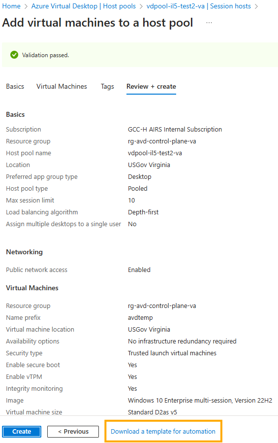
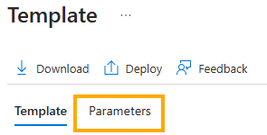
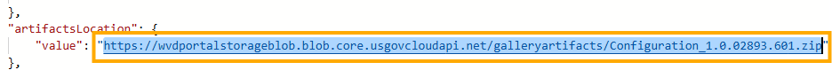
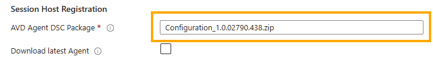

[**Home**](../README.md) | [**Design**](design.md) | [**Features**](features.md) | [**Get Started**](quickStart.md) | [**Parameters**](parameters.md) | [**Scope**](scope.md) | [**Zero Trust Framework**](zeroTrustFramework.md)

# Troubleshooting

## Role Assignment Failure

### Symptom

You receive an error similar to the following:

```json
{
    "status": "Failed",
    "error": {
        "code": "RoleAssignmentUpdateNotPermitted",
        "message": "Tenant ID, application ID, principal ID, and scope are not allowed to be updated."
    }
}
```

### Problem

You may have orphaned role assignments.

### Solution

Fix this issue by running the following PowerShell commands from the Cloud Shell.


```powershell
$orphanedRoleAssignments = Get-AzRoleAssignment | Where-object -Property Displayname -eq $null
if ($orphanedRoleAssignments.Count -eq 0) {
    Write-Output "No orphaned role assignments found. Exiting."
    exit 0
}
Write-Output "Total number of orphaned role assignments: $($orphanedRoleAssignments.Count)"
 
$orphanCounter = 0
foreach ($assignment in $orphanedRoleAssignments) {
    $orphanCounter++
    Write-Output "Attempting to remove item number $orphanCounter for RoleAssignmentName: $($assignment.RoleAssignmentName) | RoleAssignmentId: $($assignment.RoleAssignmentId) | ObjectId: $($assignment.ObjectId) | RoleDefinitionName: $($assignment.RoleDefinitionName) | Scope: $($assignment.Scope)"    
    Remove-AzRoleAssignment -ObjectId $assignment.ObjectId -RoleDefinitionName $assignment.RoleDefinitionName -Scope $assignment.Scope    
    Write-Output "Successfully removed item number $orphanCounter"
}
```

## Redeployment

If you need to redeploy this solution due to an error or to add resources, be sure the virtual machines (aka session hosts) are turned on.  For "pooled" host pools, you must disable scaling as well.  If the virtual machines are shutdown, the deployment will fail since virtual machine extensions cannot be updated when virtual machines are in a shutdown state.

If you existing deployment resource groups, you should delete the virtual machine in this resource group in order to ensure a fresh virtual machine is used to run the deployment scripts leveraged by this solution.

## WinError 193

### Symptom

[WinError 193] %1 is not a valid Win32 application
... missing tolower

### Problem

Corrupt Bizep Install

### Solution

Reinstall Bicep by following the steps at [Bicep Installation](quickStart.md#bicep-installation)

## AVD Agent Install and Configuration Failed

### Symptom

The Session Host deployment failed and after digging into the deployment you find that the 'AVDAgentInstallandConfig' DSC extension failed.

### Problem

This may be due to an issue with the file name (or Url) specified in the 'avdAgentsDSCPackage' parameter of the deployment.

### Solution

Complete these steps to determine if this is the issue.

1. Review the inputs of your failed deployment at the root level. Look for and save the value of the 'avdAgentsDSCPackage' parameter to Notepad. Keep Notepad Open.

2. Follow the standard portal instructions from [Add session hosts to a host pool](https://learn.microsoft.com/en-us/azure/virtual-desktop/add-session-hosts-host-pool?tabs=portal%2Cgui&pivots=host-pool-standard) to the **Review + create** tab, but do not click **Create**.
   
3. Select **Download a template for automation**.

   

4. Select the **Parameters** link on the **Template** screen.

   

5. Search for the **artifactsLocation** parameter and then copy the contents to Notepad below the entry from Step 1

   

6. Compare the values and note if the value is incorrect. Update the 'avdAgentsDSCPackage' parameter value in your parameters file or use this new value in the **AVD Agent DSC Package** text box on the **Session Hosts** pane of the template spec (or blue-button deployment).

   
